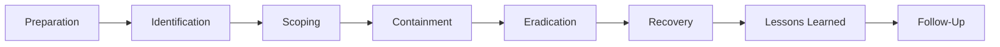
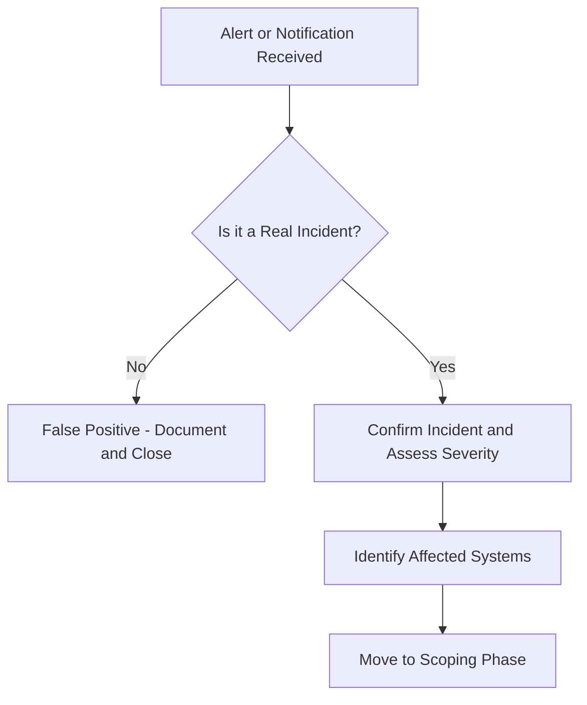
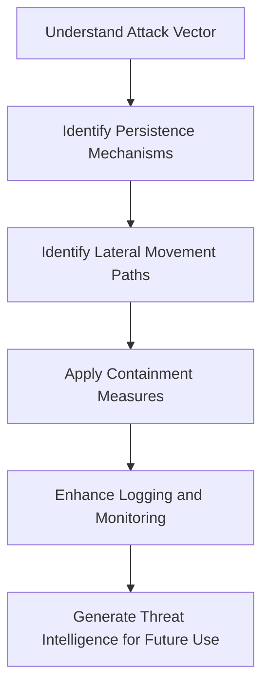
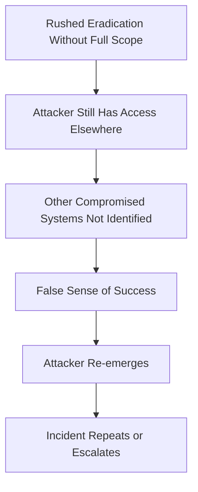
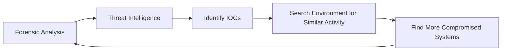
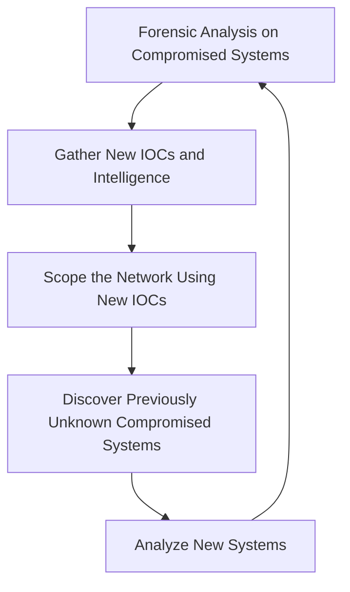
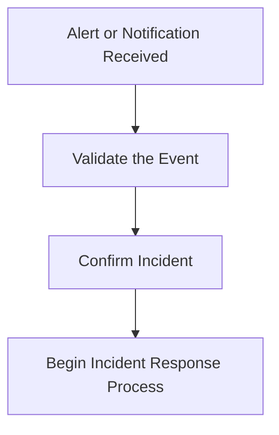
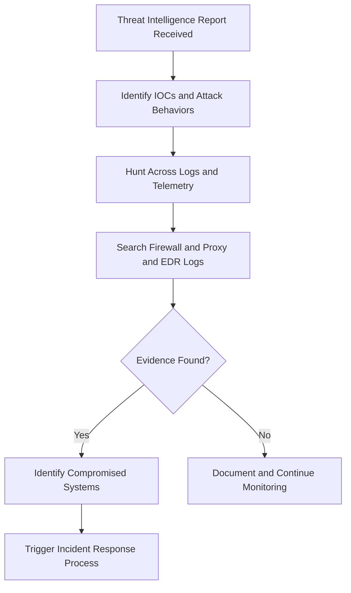
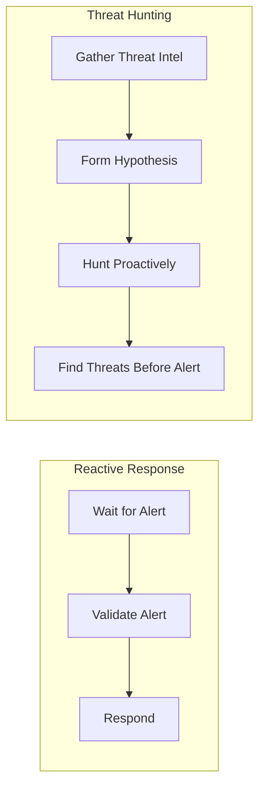

> **الهدف من الـ Section ده:**  
> هتفهم إزاي الـ Incident Response بيشتغل خطوة بخطوة، وإيه الأخطاء الشائعة اللي بتخلي الـ Attacker يفضل موجود في الـ Environment حتى بعد ما تحاول تطرده، وإيه الفرق بين الـ Reactive Response والـ Threat Hunting، وإزاي الـ IOCs بتتكوّن وبتساعدك كـ SOC Analyst تشوف الصورة كاملة.
---

## Table of Contents

- [Incident Response Process](#incident-response-process)
- [The Seven Phases](#the-seven-phases)
  - [Preparation](#1-preparation)
  - [Identification](#2-identification)
  - [Scoping](#3-scoping)
  - [Containment](#4-containment)
  - [Eradication](#5-eradication)
  - [Recovery](#6-recovery)
  - [Lessons Learned](#7-lessons-learned)
  - [Follow-Up](#8-follow-up-bonus-phase)
- [Rushing to Eradication - Common Mistake](#rushing-to-eradication---common-mistake)
- [How IOCs Are Created](#how-iocs-are-created)
- [The Cycle of Scoping and Intelligence Development](#the-cycle-of-scoping-and-intelligence-development)
- [Reactive Response](#reactive-response)
- [Threat Hunting](#threat-hunting)
- [Reactive Response vs Threat Hunting](#reactive-response-vs-threat-hunting)
- [Summary](#summary)

---

## Incident Response Process

الـ Incident Response مش بس ردة فعل على هجوم، ده في الأساس **عملية منظمة** بتساعد الـ Organization إنها تتعامل مع الـ Security Incidents بشكل صح — من أول ما تكتشف الهجوم، لحد ما ترجع كل حاجة طبيعية، وتتعلم من اللي حصل.

الـ Framework الأكتر استخداماً في الـ Industry لعملية الـ Incident Response هو اللي وثّقه **NIST** — وبيتقسم لـ **سبع مراحل** (أو تمانية لو اعتبرنا الـ Follow-Up).

> [!IMPORTANT]
> الترتيب ده مش مجرد اقتراح — هو ترتيب منطقي وكل مرحلة بتبني على اللي قبلها. لو قفزت على مرحلة، ممكن يفضل الـ Attacker موجود وانت ماشادش باله.

---

## The Seven Phases

### 1. Preparation

الـ Preparation هي المرحلة اللي بتحصل **قبل** ما يحصل أي Incident. الفكرة هي إنك ما تستناش الهجوم يحصل عشان تفكر تعمل إيه.

**الهدف:**
- بناء الـ Capabilities والأدوات والـ Processes اللي هتحتاجها لما الهجوم يحصل فعلاً.
- تقليل احتمالية حدوث الـ Incidents من الأصل بتحصين الـ Environment.

**أمثلة عملية:**

| الإجراء | الهدف منه |
|---|---|
| تشكيل Incident Response Team (IRT) | يكون في فريق متخصص وجاهز للتعامل مع الـ Incidents |
| عمل Escalation Procedures وـ Playbooks | الكل يعرف دوره وخطواته لما يحصل حاجة |
| Patch Management منتظم | تقليل الـ Attack Surface |
| نشر Firewalls وـ IDS/IPS وـ Network Segmentation | حماية الـ Infrastructure |
| تدريب الموظفين على Phishing | تقليل نجاح الـ Social Engineering |
| عمل Backups واختبار الـ Restoration | ضمان الـ Business Continuity |

> [!TIP]
> الـ Preparation هي أهم مرحلة في الـ Incident Response، لأن اللي بتعمله هنا بيحدد كفاءة ردك في كل المراحل الجاية. فريق غير مستعد هيتأخر ويغلط تحت الضغط.

---

### 2. Identification

هنا بيبدأ الـ Incident Response فعلاً — لما تيجي إشارة إن في حاجة غلط.

**الهدف:**
- التحقق من إن الـ Event ده يمثل Incident حقيقي ولا لأ (False Positive؟).
- تحديد الـ Severity وأيه الأنظمة المتأثرة.

**مصادر الـ Alert:**
- Security Alert من أدوات زي SIEM أو EDR
- Help Desk Report (يوزر بلّغ إن في حاجة غريبة)
- Threat Hunting Activity (فريق النخبة لقى حاجة بنفسه)
- External Partner أو Law Enforcement

**مثال:**
- EDR Alert بتقول إن Workstation نفّذ PowerShell Command معروف إنه Malicious.
- Threat Hunters لاقوا Evidence of Compromise وهم بيراجعوا Threat Intelligence Report.

> [!NOTE]
> مش كل Alert بيكون Incident حقيقي. جزء كبير من شغل الـ SOC Analyst في الـ Identification هو تحديد الـ False Positives بدقة وسرعة.

---

### 3. Scoping

بعد ما تأكدت إن في Incident، دلوقتي محتاج تعرف **الصورة الكاملة**: الهجوم وصل فين؟ أثّر على إيه؟ بدأ إمتى؟

**الهدف:**
- تحديد كل الـ Affected Systems.
- فهم امتداد الهجوم (Depth & Breadth).
- الإجابة على: **Who? What? When? Where? How?**

**مثال عملي:**
- الـ Identification: Threat Hunter لاقى Host بيتكلم مع Malicious IP.
- الـ Scoping:
  - كام Host تاني بيتكلم مع نفس الـ IP؟
  - بقاله قد إيه كده؟
  - النتيجة: "أربع Endpoints بتتكلم مع الـ Malicious Infrastructure."

> [!IMPORTANT]
> الـ Scoping الصح هو اللي بيحدد نجاح كل المراحل الجاية. لو الـ Scope غلط أو ناقص، هتعتقد إنك خلصت الهجوم وهو لسه موجود.

---

### 4. Containment

دلوقتي فاهم الهجوم وعارف نطاقه — الخطوة دي هي إنك تمنع الـ Attacker من الانتشار أكتر وتوقف الضرر.

**الهدف:**
- فهم الـ Attack Vector وطريقة الـ Access.
- وقف انتشار الهجوم من غير ما تمسح الـ Evidence.
- زيادة الـ Logging والـ Monitoring لو محتاج visibility أكتر.

**أمثلة:**
- Isolate المكينة المتأثرة من الـ Network.
- Disable الـ Compromised User Account.
- Block الـ Malicious IP أو Domain على الـ Firewall.

> [!WARNING]
> الـ Containment مش معناها إنك قضيت على الـ Attacker — معناها إنك قيّدت حركته. لازم الـ Scoping يكون كامل قبل ما تتحرك للـ Eradication.

---

### 5. Eradication

دي المرحلة اللي بتشيل فيها التهديد من الـ Environment خالص.

**الهدف:**
- إزالة كل أثر للـ Attacker: Malware، Backdoors، Compromised Accounts.
- التأكد إنك فاهم الـ Full Scope قبل ما تبدأ.

**أمثلة:**
- Block الـ Malicious Domains.
- Rebuild أو Restore الأنظمة المتأثرة.
- Reset وتدوير كل الـ Passwords المتأثرة.
- Validate إن الـ Remediation اتنفذت صح.

> [!IMPORTANT]
> لازم تتأكد إن الـ Scoping كامل **قبل** الـ Eradication. لو بدأت تمسح من غير ما تعرف كل حاجة، ممكن يفضل الـ Attacker موجود في مكان تاني.

---

### 6. Recovery

بعد ما مسحت التهديد، دلوقتي وقت ترجّع الأنظمة للشغل الطبيعي.

**الهدف:**
- استعادة الـ Systems للـ Production بأمان.
- التأكد من غياب أي أثر متبقي للـ Attacker.

**أمثلة:**
- Reconnect الأنظمة للـ Production Network.
- Reset الـ User Passwords.
- Monitoring طويل المدى للتأكد إن الـ Threat مرجعتش.

> [!TIP]
> الـ Recovery مش مجرد "شغّل التياب". لازم تعمل Monitoring مكثف بعديها للتأكد إن مفيش Persistence Mechanism فاتك.

---

### 7. Lessons Learned

بعد ما كل حاجة اتحلت، وقت تتعلم وتتحسن.

**الهدف:**
- تحسين الـ Security Posture عشان الحادثة دي ما تتكررش.
- توثيق كل حاجة اتعلمتها من الـ Incident.

**أمثلة على التحسينات:**

| المجال | التحسين المقترح |
|---|---|
| Authentication | تحسين الـ Enterprise Authentication Model |
| Monitoring | تحسين الـ Network Monitoring والـ Visibility |
| Patch Management | تطبيق برنامج Patch Management شامل |
| SIEM | تحسين الـ Centralized Log Collection |
| Passwords | تقوية الـ Password Management |
| Awareness | برنامج Security Awareness Training مستمر |
| Architecture | تحسين الـ Network Segmentation |

---

### 8. Follow-Up (Bonus Phase)

بعض الـ Frameworks بتضيف مرحلة تامنة، وهي الـ Follow-Up.

**الهدف:**
- التأكد إن الـ Attacker مأجلش أي Access في الـ Environment.
- التحقق من إن الـ Remediation Actions اتنفذت صح وشغالة.

**الأنشطة:**
- Threat Hunting إضافي.
- Security Assessments.
- مراجعة الـ Security Controls الجديدة.

> [!NOTE]
> بعض الـ Organizations بتدمج الـ Follow-Up مع الـ Lessons Learned. المهم هو إن الفكرة موجودة: ما تقولش "خلصنا" وتمشي — لازم تتحقق.

---

## Rushing to Eradication - Common Mistake

ده واحد من أكتر الأخطاء اللي بتحصل في الـ Real World.

### إيه المشكلة؟

تحت ضغط الـ Management وعشان الكل عايز يرجع يشتغل بسرعة، كتير من الـ Organizations بتعمل الآتي:
- Disconnect الأنظمة المتأثرة فوراً.
- Block الـ Malicious IPs.
- Rebuild الأجهزة.
- Reset الـ User Accounts.

**والنتيجة؟**

### ليه بيحصل كده؟

لو الـ Root Cause مش متحددة وما اتعالجتش، الـ Attacker هيلاقي طريق تاني يرجع منه — عن طريق:
- Compromised Systems تانية ما اتعرفتش في الـ Scoping.
- Persistence Mechanisms زي Scheduled Tasks أو Registry Keys أو Backdoors.
- Compromised Accounts تانية.

> [!WARNING]
> الـ Organizations اللي بترفع أيديها وتقول "خلصنا" قبل الـ Full Scoping غالباً بيكتشفوا بعد كده إن الـ Attacker مكانش مسافر خالص.

> [!IMPORTANT]
> **القاعدة الذهبية:** كلما كان الـ Scoping أدق وأعمق، كلما كانت قدرتك على الـ Eradication الكاملة أحسن. "The better you can scope your incident and learn about your adversary, the more eventual control you will have over the results."

---

## How IOCs Are Created

الـ IOC أو **Indicator of Compromise** هو أي أثر أو علامة على إن في Compromise حصل في الـ Environment.

### الـ IOCs بتيجي من فين؟

معظم وقت الـ Incident Response بينصرف في **فهم الهجوم والـ Attacker** — ومن الفهم ده بتتولد الـ IOCs.

### أمثلة على الـ IOCs:

| نوع الـ IOC | مثال |
|---|---|
| Malicious File Hash | MD5 / SHA256 لـ Malware |
| Malicious IP Address | IP بتتكلم معاه الأجهزة المتأثرة |
| Malicious Domain | Domain بيستخدمه الـ C2 Server |
| Compromised User Account | Account بيعمل لوجين في أوقات غريبة |
| Suspicious Command | PowerShell Command معروف في الـ Threat Intel |

> [!NOTE]
> كلما اتجمع عندك IOCs أكتر، كلما قدرت تشوف الصورة الأكبر: إيه أهداف الـ Attacker، وإيه Capabilities عنده، وإيه خطواته الجاية.

---

## The Cycle of Scoping and Intelligence Development

الـ Scoping والـ Intelligence Development مش مرحلتين منفصلتين — هما **Mini Cycle** بيغذّي بعضه.

### الـ Cycle بيشتغل إزاي؟

1. بتعمل **Forensic Analysis** على الأنظمة اللي عارفها.
2. بتلاقي **IOCs جديدة** — IPs، Domains، Files، Commands.
3. بتستخدم الـ IOCs دي تبحث في الـ Network.
4. بتلاقي **Systems جديدة متأثرة** ما كنتش عارفها.
5. بتحللها وبتلاقي **Intelligence جديدة** وـ IOCs تانية.
6. والحلقة بتكرر نفسها لحد ما تتأكد إنك طوّقت الـ Incident كامل.

> [!TIP]
> الـ Cycle ده مش علامة ضعف — ده علامة إن فريقك شاطر وبيتعمق في الحقيقة. كل لفة في الـ Cycle بتجيب معاها وضوح أكتر.

---

## Reactive Response

الـ Reactive Response هو الـ Approach التقليدي في الـ Incident Response — بتستنى حاجة تعلمك إن في مشكلة، وبعدين بتتحرك.

### إزاي بيشتغل؟

### مصادر الـ Alerts:
- Internal Security Tools (SIEM، EDR، Firewall Alerts)
- Users (بيبلّغوا إن في حاجة غريبة)
- External Partners
- Law Enforcement (زي EG-CERT في مصر)

### مميزاته ومحدوداته:

| الجانب | التفاصيل |
|---|---|
| المميزات | منظم، واضح، الكل عارف دوره لما يجي Alert |
| المحدودية | مش كل الهجمات بتولّد Alerts — ممكن الـ Attacker يفضل موجود أسابيع أو أشهر من غير ما حد يحس |

> [!NOTE]
> مع نمو الـ Organization وزيادة الـ Incident Volume، ممكن يتكوّن فريق متخصص للـ Incident Response، وأحياناً بيتكملوا بـ External IR Consultants في الـ Major Incidents.

---

## Threat Hunting

الـ Threat Hunting هو الـ Approach الاستباقي — بدل ما تستنى الـ Alert، انت نفسك بتدور على التهديدات.

### ليه بيحتاجوا Threat Hunting؟

لأن الـ Reactive Response لوحده مش كفاية — في هجمات بتعدي الـ Security Controls من غير ما تولّد أي Alert. الـ Threat Hunting موجود عشان يقلل الـ **Attacker Dwell Time** (الوقت اللي الـ Attacker فيه موجود في الـ Network من غير ما حد يعرف).

### Threat Hunting Scenario:

**الموقف:**
- Threat Intelligence Report بيحدد Malicious IP مرتبط بـ Ransomware Group.

**الـ Hunting Activity:**
1. البحث في الـ Firewall Logs، Proxy Logs، وـ EDR Logs عن أي Connection للـ IP ده.
2. تحديد الأجهزة اللي اتكلمت معاه.
3. التحقيق في الأجهزة دي عن أي Signs of Compromise إضافية.

**النتيجة:**
- الفريق اكتشف Infected Workstation ما كانتش ولّدت أي Security Alert خالص.

> [!IMPORTANT]
> الـ Threat Hunting مش بديل للـ Reactive Response — هو **مكمّل** ليه. محتاج الاتنين مع بعض.

---

## Reactive Response vs Threat Hunting

| المعيار | Reactive Response | Threat Hunting |
|---|---|---|
| نقطة البداية | Alert أو Notification | Threat Intelligence أو Hypothesis |
| الأسلوب | Reactive (رد فعل) | Proactive (استباقي) |
| الهدف | معالجة الـ Known Threat | اكتشاف الـ Unknown Threat |
| المتطلبات | SIEM، EDR، Playbooks | Threat Intel، Advanced Log Analysis |
| الـ Dwell Time | ممكن يطول لحد ما Alert تيجي | بيتقلص بشكل كبير |

> [!TIP]
> الـ Organizations الناضجة أمنياً بتعمل الاتنين: فريق Reactive بيتعامل مع الـ Alerts، وفريق Threat Hunting بيدور على التهديدات اللي فاتت على الـ Alerts.

---

## Summary

- الـ **Incident Response** عملية من **7 مراحل** (أو 8 مع الـ Follow-Up) موثّقة من NIST: Preparation، Identification، Scoping، Containment، Eradication، Recovery، Lessons Learned.

- الـ **Preparation** هي أهم مرحلة — لأنها بتحدد جاهزيتك لكل المراحل التانية.

- الـ **Scoping** هو قلب العملية — من غير Scope صح، مش هتعرف تطرد الـ Attacker بشكل كامل.

- **الخطأ الشائع** هو الـ Rushing to Eradication — الضغط من الـ Management بيخلي الفرق تمسح التهديد من غير ما تفهمه كامل، وبالتالي الـ Attacker بيرجع.

- الـ **IOCs** بتتولد من التحليل الجنائي للأنظمة المتأثرة، وبتستخدم في التوسع في الـ Scope واكتشاف أنظمة جديدة.

- الـ **Scoping والـ Intelligence Development** بيكوّنوا Cycle مستمر بيغذّي نفسه لحد ما يتأكد الفريق إنه طوّق الـ Incident كامل.

- الـ **Reactive Response** بيعتمد على الـ Alerts، بينما الـ **Threat Hunting** بيدور على التهديدات اللي فاتت على الـ Alerts — والاتنين مكمّلين لبعض.

- هدف الـ **Threat Hunting** الأساسي هو تقليل الـ **Attacker Dwell Time** — يعني مدة وجود الـ Attacker في الـ Network من غير ما حد يعرف.
