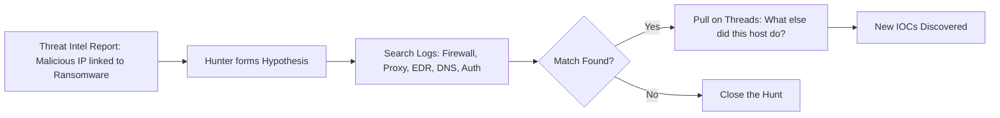
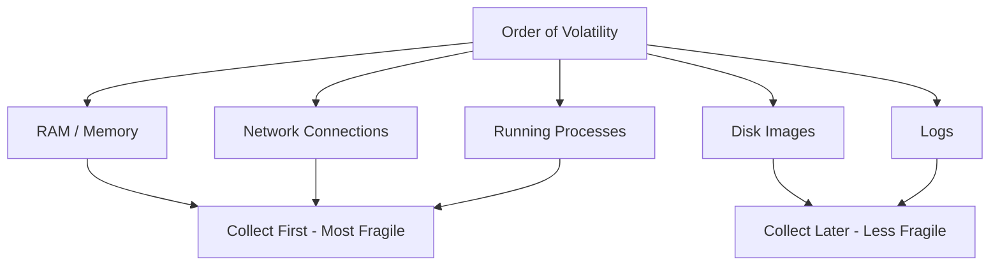
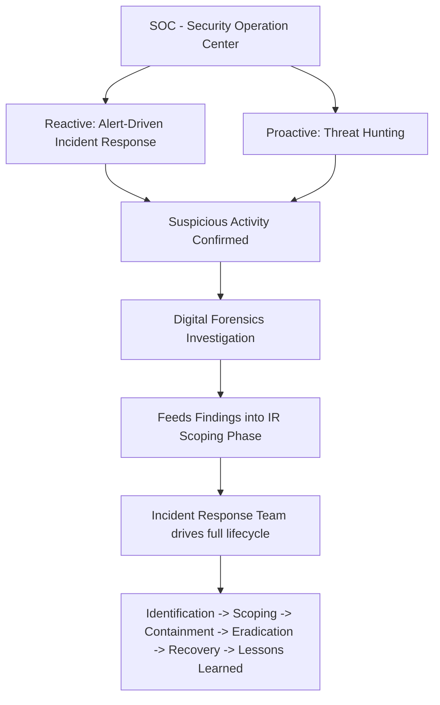

> **الهدف من الـ Section ده:**  
>  هتفهم إيه هو الـ **SOC** وإيه وظيفته الأساسية، وهتعرف الفرق بين الـ **Reactive Approach** (اللي هو Incident Response) والـ **Proactive Approach** (اللي هو Threat Hunting)، وكمان هتفهم دور الـ **Digital Forensics** وإزاي الثلاثة بيشتغلوا مع بعض كـ Team واحد عشان يحموا الـ Organization.

## Table of Contents

- [Overview](#overview)
- [SOC Core Functions](#soc-core-functions)
  - [Continuous Monitoring](#continuous-monitoring)
  - [Alert Triage and Analysis](#alert-triage-and-analysis)
  - [Incident Response](#incident-response)
  - [Threat Intelligence](#threat-intelligence)
  - [Key Tools SOC Relies On](#key-tools-soc-relies-on)
- [Threat Hunting Core Functions](#threat-hunting-core-functions)
  - [Why Threat Hunting Exists](#why-threat-hunting-exists)
  - [How Threat Hunting Works in Practice](#how-threat-hunting-works-in-practice)
  - [Real-World Scenario](#real-world-scenario)
- [Digital Forensics Core Functions](#digital-forensics-core-functions)
  - [Where DF Fits Within IR](#where-df-fits-within-ir)
  - [Core Functions of Digital Forensics](#core-functions-of-digital-forensics)
- [How They Connect Together](#how-they-connect-together)
- [Summary](#summary)

---

## Overview

في الـ Section ده هنتكلم عن 3 مفاهيم أساسية في عالم الـ Cybersecurity Operations:

1. **SOC (Security Operation Center)** — الفريق والمكان اللي بيراقب ويدافع عن المؤسسة.
2. **Threat Hunting** — النهج الـ Proactive اللي بيدور على التهديدات قبل ما تعمل Alert.
3. **Digital Forensics** — التخصص اللي بيجاوب على سؤال "إيه اللي حصل بالظبط؟".

> [!NOTE]
> الثلاثة مش منفصلين عن بعض؛ دول أجزاء من نفس المنظومة، وكل واحد فيهم بيغذي التاني بالـ Information.

---

## SOC Core Functions

الـ **SOC (Security Operation Center)** هو الـ centralized team والـ facility المسؤولة عن الـ continuous monitoring والـ detection والـ analysis والـ response لأي تهديدات أمنية عبر الـ networks والـ systems والـ data بتاعة المؤسسة.

بمعنى تاني: الـ SOC هو "غرفة العمليات" اللي بتراقب كل حاجة بتحصل على مستوى الشبكة والأنظمة 24/7.

### Continuous Monitoring

الـ Analysts بيراقبوا الـ logs والـ alerts والـ traffic على مدار الساعة (غالبًا بنظام الـ shifts) عشان يكتشفوا أي نشاط مشبوه (malicious activity) أول ما يحصل.

### Alert Triage and Analysis

لما أي أداة أمنية زي الـ **SIEM**، أو الـ **EDR**، أو الـ **IDS/IPS** تطلق Alert، دور الـ Analyst إنه يحقق فيها عشان يحدد:

- هل الـ Alert ده حقيقي ولا **False Positive**؟
- إيه مستوى خطورته (Severity)؟
- إيه الإجراء اللي المفروض يتاخد بعد كده؟

الـ **Alert Triage** هي العملية اللي بتحصل بسرعة عشان تحلل وترتب أولويات الـ Alerts بناءً على النقط دي.

> [!IMPORTANT]
> مش كل Alert بيبقى Incident حقيقي. جزء كبير من شغل الـ SOC Analyst هو إنه يفلتر الـ Noise ويركز بس على اللي فعلاً محتاج Response.

### Incident Response

لو اتأكد إن الـ Alert فعلاً Incident حقيقي، الـ SOC هو اللي بيقود عملية الـ **Incident Response**، وده بيرتبط مباشرة بالـ Seven-Step IR Process (Identification, Scoping, Containment, Eradication, Recovery, Lessons Learned...).

### Threat Intelligence

الـ SOC كمان بيتابع الـ **known malicious IPs**، والـ **domains**، والـ **malware signatures**، وتقنيات الـ attackers، عشان يحسّن قدرته على الـ Detection باستمرار.

### Key Tools SOC Relies On

| Tool | Purpose |
|---|---|
| **SIEM** (Security Information and Event Management) | Log aggregation and correlation — بيجمع الـ Logs من كل مكان وبيربطها ببعض |
| **EDR** (Endpoint Detection and Response) | Host-level visibility — رؤية على مستوى الـ Endpoint نفسه |
| **Firewall / IDS / IPS / NDR** | Network-level detection — كشف على مستوى الشبكة |
| **Threat Intelligence Feeds** | معلومات محدثة عن الـ Attackers والـ IOCs |

> [!TIP]
> فكر في الـ SIEM كأنه "العقل المركزي" اللي بيجمع كل الـ Logs من الـ Firewall والـ EDR والـ Servers في مكان واحد، عشان الـ Analyst يقدر يشوف الصورة الكاملة بدل ما يفتح كل أداة لوحدها.

---

## Threat Hunting Core Functions

الـ **Threat Hunting** هو بحث استباقي (Proactive) عن تهديدات نجحت بالفعل إنها تتفادى أدوات الأمان الموجودة، بدل ما ننتظر إن الـ Alert يطلق لوحده. وده بيعتبر جزء من الـ SOC.

### Why Threat Hunting Exists

الـ Incident Response التقليدي بيبقى **Reactive** ومبني على الـ Alerts — يعني بيكشف بس اللي الأدوات متظبطة عليها إنها تكتشفه. المهاجمين المحترفين عارفين النقطة دي، فبيصمموا تقنياتهم عشان "تندمج" في البيئة العادية أو تفضل هادية جدًا، وده بيخليهم يقعدوا فترة طويلة جوه الشبكة من غير ما يطلقوا أي Alert؛ الفترة دي اسمها **Dwell Time**.

الـ Threat Hunting موجود تحديدًا عشان يقلل الـ Dwell Time، عن طريق إن الفريق يروح يدور على الـ Attacker بنفسه بدل ما يستنى.

> [!WARNING]
> الاعتماد الكامل على الـ Alerts بس (Reactive Monitoring) بيدي إحساس زائف بالأمان؛ المهاجم اللي بيتحرك ببطء وبذكاء ممكن يفضل شهور جوه الشبكة من غير ما حد يلاحظه.

### How Threat Hunting Works in Practice

1. الـ Hunters بيبدأوا بـ **Hypothesis**، غالبًا مبنية على Threat Intelligence (مثال: "الـ IP ده مرتبط بمجموعة Ransomware معروفة") أو ملاحظة نمط غريب في البيئة.
2. بعدين بيغوصوا جوه الـ Logs (Firewall, Proxy, EDR, DNS, Authentication logs) بحثًا عن أي تطابق مع الـ Hypothesis دي.
3. بيكملوا التتبع خطوة بخطوة (Pulling on Threads): لو جهاز اتكلم مع IP خبيث، إيه كمان اللي عمله الجهاز ده؟ مين عمل Login عليه؟ إيه الـ Processes اللي شغالة؟
4. النتيجة النهائية غالبًا بتكون **IOCs (Indicators of Compromise)** جديدة — يعني الـ Hunt أثبت إنه كان له قيمة، أو ممكن تتقفل الـ Hunt لو مفيش حاجة اتلاقت.

### Real-World Scenario

تخيل إن تقرير Threat Intel جالك بيقول إن فيه IP خبيث مرتبط بـ Ransomware. الـ Hunters بيدوروا في الـ Logs على أي جهاز اتواصل مع الـ IP ده، فبيكتشفوا **workstation** اتخترقت فعلًا لكنها ماعملتش ولا Alert واحد.

ده بالظبط القيمة الحقيقية للـ Threat Hunting — كشف حاجة الـ Reactive Monitoring فوّتها تمامًا.

> [!NOTE]
> في أي SOC ناضج (Mature)، الاتنين بيكونوا موجودين مع بعض: ناس بترد على الـ Alarms (Reactive)، وناس بتدور بنفسها على اللي الـ Alarms فوّتته (Proactive).

---

## Digital Forensics Core Functions

لو الـ Incident Response بيسأل: "إزاي نوقف الهجوم؟ إزاي نحتويه (Contain)؟ إزاي نرجع الوضع الطبيعي؟"، فالـ **Digital Forensics** بيسأل أسئلة مختلفة تمامًا:

- إيه اللي حصل بالظبط؟
- إمتى حصل؟
- إزاي المهاجم قدر يدخل؟
- إيه الأفعال اللي المهاجم عملها؟
- إيه الدليل اللي بيثبت كل ده؟

الهدف الأساسي من الـ Digital Forensics هو إعادة بناء أحداث الحادث (Reconstruct the Incident) وتقديم دليل موثوق (Reliable Evidence) ممكن يستخدم في التحقيقات التقنية، أو الالتزام بالـ Compliance، أو حتى في الإجراءات القانونية لو لزم الأمر.

### Where DF Fits Within IR

الـ Digital Forensics بيشتغل كـ **Evidentiary Backbone** لمراحل معينة من عملية الـ Incident Response، وبالتحديد مرحلتي:

- **Identification**
- **Scoping**

في أثناء التحقيق، الـ Forensic Analysis بيتم استخدامه عشان:

- يحدد إيه اللي حصل.
- يحدد مدى اتساع الاختراق (Scope of Compromise).
- يكتشف أي Systems أو Users أو Artifacts إضافية اتأثرت.

المعلومات اللي بتتجمع من التحليل الجنائي بتساعد فريق الـ Response إنه يوسع التحقيق، ويفهم تحركات المهاجم بدقة، ويحدد الحجم الكامل للحادث — وده بيساعدهم ياخدوا قرارات مبنية على معلومات دقيقة طول عملية الـ Response.

### Core Functions of Digital Forensics

> [!IMPORTANT]
> الحفاظ على سلامة الدليل (**Evidence Integrity**) هو أهم حاجة في الـ Digital Forensics. أي تعديل بسيط على الدليل الأصلي ممكن يخليه غير مقبول قانونيًا أو غير موثوق فيه.

- **Preserve Evidence Integrity**: عن طريق تقنيات زي الـ **Forensic Imaging** (نسخ Bit-for-Bit من الأصل) عشان الدليل الأصلي متتغيرش أبدًا، مع الاحتفاظ بـ **Chain of Custody** موثّق بدقة.
- **Order of Volatility**: لازم تجمع الأدلة الأكثر هشاشة (Fragile) الأول — زي الـ **RAM**، الـ **Network Connections**، الـ **Running Processes** — قبل ما تروح للأدلة الأقل تطايرًا زي الـ **Disk Images** والـ **Logs**، لأن بعض الأدلة بتختفي فورًا لما الجهاز يتقفل أو يتعمله Reboot.
- **Malware Analysis / Reverse Engineering**: تفكيك الملف الخبيث (سواء Static Analysis أو تشغيله جوه Sandbox) عشان تفهم بالظبط بيعمل إيه، وده بينتج IOCs جديدة (ممكن يبقى Role كامل منفصل اسمه DF Analyst).

> [!WARNING]
> لو قفلت الجهاز المصاب فورًا (Power Off) قبل ما تجمع الـ RAM، ممكن تخسر أدلة حيوية جدًا زي الـ Processes الشغالة والاتصالات النشطة اللي كانت ممكن تكشف المهاجم.

الـ Digital Forensics مهم جدًا للـ IR لأنه هو اللي بيجاوب فعليًا على أسئلة الـ **Who, What, When, Where, and How**.

---

## How They Connect Together

أسهل طريقة تفهم بيها العلاقة دي:

- الـ **SOC** هو الفريق المسؤول عن مراقبة المؤسسة والدفاع عنها.
- الـ **Threat Hunting** والـ **Reactive Incident Response** هما الأسلوبين اللي الـ SOC بيستخدمهم عشان يكتشف ويرد على التهديدات.
- لما يتم اكتشاف نشاط مشبوه (سواء عن طريق Alert أو Hunt)، الـ **Digital Forensics** بييجي يحقق فيه بعمق، ويحدد حجم الهجوم الكامل، ويفهم بالظبط المهاجم عمل إيه.

في أغلب المؤسسات، فريق الـ **Incident Response** (أو الـ **Incident Commander**) هو اللي بيدير كل حاجة من الأول للآخر — بينسق الـ Identification والـ Scoping والـ Containment والـ Eradication والـ Recovery والـ Lessons Learned.

الـ **Digital Forensics** بيبقى دور دعم متخصص (Supporting Specialist Function) بيستدعيه فريق الـ IR عشان يجاوب على أسئلة دليلية محددة زي: "إيه اللي حصل بالظبط على الجهاز ده؟"، "إيه اللي المهاجم لمسه؟"، "نقدر نثبت الـ Timeline ده؟". الـ DF بيغذي نتائجه في مرحلة الـ **Scoping** بتاعة الـ IR، وعادة مش هو اللي بيدير الحادث بنفسه.

> [!NOTE]
> في المؤسسات الأصغر، الفرق ده غالبًا مش موجود أصلًا؛ نفس الفريق (المعروف باسم **DFIR**) بيعمل الاتنين، وبس بيغير "القبعة" حسب اللحظة: قبعة IR وقت ما بيوقف المهاجم فعليًا، وقبعة DF وقت ما بيحفر عميق يعرف إيه اللي حصل بالظبط على جهاز معين.

### Quick Comparison Table

| Function | Approach | Main Question | Output |
|---|---|---|---|
| **SOC (general)** | Continuous Monitoring | هل فيه نشاط مشبوه دلوقتي؟ | Alerts, Escalations |
| **Threat Hunting** | Proactive | هل فيه تهديد قاعد مختبي دلوقتي؟ | New IOCs |
| **Incident Response** | Reactive | إزاي نوقف الهجوم ونتعافى منه؟ | Containment & Recovery |
| **Digital Forensics** | Investigative | إيه اللي حصل بالظبط وإمتى وإزاي؟ | Evidence & Timeline |

---

## Summary

- الـ **SOC** هو الفريق المسؤول عن الـ Continuous Monitoring، الـ Alert Triage، الـ Incident Response، والـ Threat Intelligence، وبيعتمد على أدوات زي الـ **SIEM**، الـ **EDR**، والـ **IDS/IPS/NDR**.
- الـ **Threat Hunting** هو نهج Proactive بيدور على تهديدات اخترقت الشبكة بالفعل من غير ما تعمل Alert، وهدفه الأساسي إنه يقلل الـ **Dwell Time**.
- عملية الـ Hunting بتعتمد على **Hypothesis**، ثم البحث في الـ Logs، ثم تتبع الخيط لحد ما توصل لـ **New IOCs**.
- الـ **Digital Forensics** هو التخصص اللي بيجاوب على "إيه اللي حصل بالظبط؟" وبيحافظ على **Evidence Integrity** من خلال الـ **Forensic Imaging** والـ **Chain of Custody**، ودايمًا بيلتزم بـ **Order of Volatility** (RAM الأول، بعدين Logs والـ Disk Images).
- الثلاثة بيشتغلوا مع بعض: الـ SOC بيكتشف من خلال الـ Reactive Response أو الـ Threat Hunting، والـ Digital Forensics بيدخل بعد كده يوضح الصورة الكاملة ويغذي نتائجه في مرحلة الـ Scoping بتاعة الـ IR.
- في المؤسسات الصغيرة، الأدوار دي غالبًا بتتجمع في فريق واحد اسمه **DFIR**.
