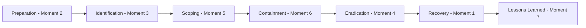

> **الهدف من الـ Section ده:**  
> هتتدرب عمليًا إنك تاخد لحظات من سيناريو هجوم حقيقي (من غير ترتيب سردي) وتحدد كل لحظة بتتبع أنهي مرحلة من مراحل الـ **Seven-Step IR Process** — وهي نفس المهارة اللي محتاجها لما تكتب تقرير Incident حقيقي وتنظمه بشكل صح.

## Table of Contents

- [Overview](#overview)
- [The Full Scenario](#the-full-scenario)
- [Attack Chain Diagram](#attack-chain-diagram)
- [IR Phase Reference (Quick Recap)](#ir-phase-reference-quick-recap)
- [The Exercise — Mapping Each Moment](#the-exercise--mapping-each-moment)
  - [Moment 1](#moment-1)
  - [Moment 2](#moment-2)
  - [Moment 3](#moment-3)
  - [Moment 4](#moment-4)
  - [Moment 5](#moment-5)
  - [Moment 6](#moment-6)
  - [Moment 7](#moment-7)
- [Answer Key at a Glance](#answer-key-at-a-glance)
- [Why the Narrative Order ≠ the IR Order](#why-the-narrative-order--the-ir-order)
- [Summary](#summary)

---

## Overview

السيناريو ده مختلف شوية عن الحالة اللي فاتت (FinCore)، لأنه بيقدم لك التحديات دي:

1. المهاجم بيستهدف **OT (Operational Technology)** — يعني أنظمة تحكم صناعية حقيقية (PLCs)، مش بس أنظمة IT عادية.
2. طريقة الدخول كانت **USB Drop Attack** — مش Phishing إيميل.
3. المهاجم استغل **Air Gap** (فصل فيزيائي بين شبكتين) عن طريق موظف بيحمل USB بنفسه من شبكة لشبكة.
4. اللحظات اللي هتحللها متقدملكش بالترتيب الزمني — دورك إنك تحدد كل لحظة بتنتمي لأنهي مرحلة IR.

> [!NOTE]
> الفكرة الأساسية من التمرين ده: **الترتيب السردي للقصة مش هو نفسه ترتيب مراحل الـ IR بالضرورة**. المحقق الجيد لازم يقدر يصنف أي حدث حسب طبيعته (استعداد، اكتشاف، تحديد نطاق...) مش حسب ترتيبه في الحكاية.

---

## The Full Scenario

شركة **Aurora Robotics** بتشغّل مصنع أوتوماتيكي لتصنيع القطع. أنظمة التحكم الصناعي (Industrial Control Systems) بتاعتها موجودة على شبكة منفصلة تمامًا (**Air-Gapped Network**)، والمهندسين بيستخدموا USB Drives أحيانًا عشان ينقلوا ملفات بين الشبكة المؤسسية (Corporate Network) وأرضية المصنع.

**تسلسل الهجوم:**

مهاجم مهتم بتعطيل عمليات Aurora قضى أسابيع بيدرس الشركة أونلاين، وبعدين سايب USB Drive متنكر في شكل أداة تحديث Firmware، قريب من موقف سيارات الموظفين. مهندس فضولي لقاه، ووصّله بجهازه على الشبكة المؤسسية، وفتح الملف المتنكر — وده شغّل **Remote-Access Implant** مخفي.

الـ Implant دا ثبّت نفسه عشان يفضل شغال حتى لو الجهاز اتعمله Restart، وابتدى يتواصل بهدوء مع المهاجم من خلال طلبات **DNS** غريبة على فترات منتظمة.

بعد أسابيع، المهندس نقل ملفات لأرضية المصنع زي العادة — من غير ما يعرف إنه بينقل معاه **Payload خبيث** عبر الـ Air Gap على نفس الـ USB. بأمر اتوصله قبل كده عن طريق قناة الـ DNS، الـ Payload دفع **Configuration تالف** لعدة أجهزة **PLC (Programmable Logic Controllers)**، وده أوقف خطين إنتاج وخرّب دفعة قطع كانت شغالة.

الـ SOC بتاع Aurora لاحظ نشاط الـ DNS الغريب من جهاز المهندس في نفس وقت توقف خطوط الإنتاج المفاجئ تقريبًا.

> [!IMPORTANT]
> السيناريو ده بيوضح خطر حقيقي جدًا في بيئات الـ **OT/ICS**: الهجوم ممكن يبدأ بالكامل من على شبكة IT عادية، ويعدي فيزيائيًا عبر جهاز تخزين (USB) لشبكة معزولة تمامًا (Air-Gapped) كانت مفروض محمية.

---

## Attack Chain Diagram

```mermaid
flowchart LR
    A[Attacker studies Aurora online] --> B[USB drive disguised as firmware tool dropped]
    B --> C[Engineer plugs USB into corporate workstation]
    C --> D[Hidden remote-access implant installs]
    D --> E[Implant beacons via unusual DNS queries]
    E --> F[Engineer transfers files via USB across air gap]
    F --> G[Malicious payload crosses to plant floor]
    G --> H[Corrupted config pushed to PLCs]
    H --> I[Two production lines halt]
```

---

## IR Phase Reference (Quick Recap)

| Phase | التعريف السريع |
|---|---|
| **Preparation** | بناء القدرات والأدوات والـ Playbooks والتدريب والـ Backups وتحصين الأنظمة **قبل** ما أي حاجة تحصل |
| **Identification** | اكتشاف حدث مشبوه والتأكد منه، وتحديد إنه Incident حقيقي، وتقييم خطورته |
| **Scoping** | تحديد اتساع وعمق الاختراق — كل الأنظمة والبيانات وأفعال المهاجم (مين/إيه/إمتى/فين/إزاي) |
| **Containment** | فهم الهجوم والحد منه — عزل الأنظمة، تعطيل الحسابات، حجب الـ Traffic، زيادة الرؤية |
| **Eradication** | إزالة التهديد بالكامل — مسح المالوير، إعادة بناء الأنظمة، إصلاح السبب الجذري، تدوير الـ Credentials |
| **Recovery** | إرجاع الأنظمة للعمل الطبيعي بأمان، ومراقبة إن التهديد مرجعش تاني |
| **Lessons Learned** | تحسين الدفاعات — Authentication، Monitoring، Patching، Segmentation، تدريب الوعي |

---

## The Exercise — Mapping Each Moment

### Moment 1

> الفريق بيرجّع الـ PLCs المتأثرة من نسخ Configuration احتياطية معروفة إنها سليمة (Known-good Backups)، ويرجّع خطي الإنتاج المتوقفين للعمل على مراحل، ويراقب جودة الإنتاج عن قرب قبل ما يرجع للتشغيل الكامل.

**IR Phase: Recovery**

> [!NOTE]
> ليه Recovery؟ الكلمات المفتاحية هنا "restores"، "brings... back online in stages"، "monitors... before resuming full operations" — كل ده رجوع تدريجي وآمن للعمل الطبيعي، مش إزالة تهديد ولا اكتشاف حدث جديد.

---

### Moment 2

> فريق أمن IT بتاع Aurora كان خلاص نصّب EDR على أجهزة الشبكة المؤسسية، وقسّم شبكة الـ OT عن الشبكة المؤسسية (Segmentation)، وكان محتفظ بـ Incident Response Playbook — رغم إن استخدام USB Drives لنقل الملفات لأرضية المصنع كان لسه مسموح بيه.

**IR Phase: Preparation**

> [!NOTE]
> ليه Preparation؟ الفعل هنا في زمن "had already deployed" — يعني كل ده حصل **قبل** الهجوم بفترة طويلة. لاحظ كمان إنها بتوضح ثغرة موجودة من الأساس (USB لسه مسموح)، وده هيتحل لاحقًا في مرحلة الـ Lessons Learned.

---

### Moment 3

> محلل SOC لاحظ طلبات DNS غريبة ومنتظمة التوقيت اتعلّم عليها الـ SIEM، وأكد إن النمط ده متوافق مع نشاط **Command-and-Control** مش سلوك تطبيق عادي.

**IR Phase: Identification**

> [!NOTE]
> ليه Identification؟ فيه اكتشاف حدث ("notices... flagged")، وفيه تأكيد إنه حقيقي مش سلوك عادي ("confirms this pattern is consistent with C2"). دي بالظبط خطوتين الـ Identification: الرصد + التأكيد.

---

### Moment 4

> الـ Implant اتشال من جهاز المهندس، والجهاز اتعمله Rebuild من نسخة نظيفة (Clean Image)، والدومينات الخبيثة اتضافت لقائمة الحظر، وبورتات الـ USB على أجهزة المهندسين اتقيدت لأجهزة معتمدة ومفحوصة بس.

**IR Phase: Eradication**

> [!NOTE]
> ليه Eradication؟ "removed"، "rebuilt from a clean image"، "added to the block list" — كل ده إزالة كاملة للتهديد وسد الثغرة التقنية المباشرة (USB Ports Restriction هنا سبب جذري تقني بيتصلح، مش سياسة عامة زي في Lessons Learned).

---

### Moment 5

> المحققين تتبعوا نشاط الـ DNS لحد ما رجعوا لجهاز المهندس، وفحصوا سجل اتصالات الـ USB بتاعه، وأكدوا إن دفع Configuration لعدة PLCs في نفس التوقيت تقريبًا هو اللي سبب توقف خطي الإنتاج.

**IR Phase: Scoping**

> [!NOTE]
> ليه Scoping؟ "trace... back to"، "examine its USB connection history"، "confirm that a config push... caused" — كل ده بناء صورة كاملة لحجم وتفاصيل الهجوم (مين اتأثر، إزاي حصل، ليه توقفت الخطوط)، قبل اتخاذ أي قرار نهائي بالتصرف.

---

### Moment 6

> جهاز المهندس اتفصل عن الشبكة، وحركة الـ Traffic الصادرة للدومينات المشبوهة اتحجبت على الـ Firewall، وأي عمليات نقل USB إضافية لأرضية المصنع اتعلقت مؤقتًا.

**IR Phase: Containment**

> [!NOTE]
> ليه Containment؟ "disconnected"، "blocked at the firewall"، "temporarily suspended" — كل ده إجراءات فورية لوقف انتشار الضرر أكتر، من غير ما يشيل السبب الجذري بعد (ده هيحصل بعدين في Eradication).

---

### Moment 7

> Aurora حدّثت سياستها لتمنع استخدام أي USB Drive غير معروف تمامًا، وطبّقت ضوابط على الـ Endpoints تمنع خاصية الـ **AutoRun**، وأضافت قدرة مراقبة مخصصة لبيئة الـ OT عشان أي تغيير Configuration مستقبلي على الـ PLCs يطلق Alert.

**IR Phase: Lessons Learned**

> [!NOTE]
> ليه Lessons Learned؟ "updates its policy"، "rolls out"، "adds an OT-specific monitoring capability" — كل ده تحسينات دائمة للدفاعات مبنية على الثغرات اللي انكشفت في الحادثة، مش استجابة مباشرة للتهديد نفسه.

---

## Answer Key at a Glance

| # | الموقف باختصار | IR Phase |
|---|---|---|
| 1 | استرجاع PLCs من Backups وتشغيل الخطوط تدريجيًا | **Recovery** |
| 2 | EDR وSegmentation وPlaybook كانوا جاهزين من قبل | **Preparation** |
| 3 | ملاحظة وتأكيد نمط DNS مشبوه كـ C2 | **Identification** |
| 4 | إزالة الـ Implant، Rebuild، حظر الدومينات، تقييد USB | **Eradication** |
| 5 | تتبع النشاط وتأكيد حجم الأنظمة المتأثرة | **Scoping** |
| 6 | فصل الجهاز، حجب الـ Traffic، تعليق نقل USB | **Containment** |
| 7 | تحديث السياسات، منع AutoRun، مراقبة OT جديدة | **Lessons Learned** |

---

## Why the Narrative Order ≠ the IR Order

لاحظ إن ترتيب اللحظات في التمرين مكانش نفسه ترتيب مراحل الـ IR (1=Recovery، 2=Preparation، 3=Identification، 4=Eradication، 5=Scoping، 6=Containment، 7=Lessons Learned). الترتيب الصحيح لمراحل الـ IR هو:

> [!WARNING]
> غلطة شائعة عند المبتدئين إنهم يفترضوا إن ترتيب أحداث القصة = ترتيب مراحل الـ IR بالظبط. في الواقع، كاتب السيناريو أو التقرير ممكن يقدملك الأحداث بأي ترتيب، ودورك كـ Analyst إنك تصنف كل حدث حسب **طبيعته** (هل ده استجابة فورية؟ ده تحقيق؟ ده تحسين مستقبلي؟) مش حسب مكانه في النص.

---

## Summary

- التمرين ده درّبك على مهارة أساسية: تصنيف أي حدث في تقرير Incident حسب **طبيعته**، مش حسب ترتيبه في السرد.
- سيناريو Aurora بيوضح تهديد خاص ببيئات الـ **OT/ICS**: هجوم بدأ بالكامل من شبكة IT عادية (USB Drop + Implant)، وعدّى فيزيائيًا لشبكة Air-Gapped عن طريق موظف بيستخدم USB بحسن نية.
- الترتيب الصحيح لمراحل الـ IR في السيناريو ده كان: **Preparation (2) → Identification (3) → Scoping (5) → Containment (6) → Eradication (4) → Recovery (1) → Lessons Learned (7)**.
- الفرق الأساسي بين **Containment** و**Eradication** واضح هنا: الـ Containment بيوقف الانتشار (فصل، حجب) من غير ما يشيل السبب، بينما الـ Eradication بيشيل التهديد فعليًا (Implant Removal، Rebuild، Root Cause Fix).
- الـ **Lessons Learned** هنا معالجت تحديدًا الثغرة اللي ظهرت في الـ Preparation (USB كان مسموح بيه) — وده بيوضح إزاي الحلقة الكاملة للـ IR Lifecycle بتقفل على نفسها وتغذي بعضها.
