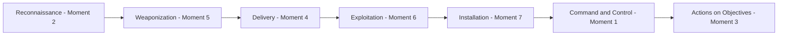

> **الهدف من الـ Section ده:**  
>  هتتدرب إنك تاخد لحظات من نفس هجوم Aurora Robotics (من غير ترتيب سردي) وتحدد كل لحظة بتتبع أنهي مرحلة من مراحل الـ **Cyber Kill Chain** — وهي فريم وورك مختلفة عن الـ IR Process، بتركز على **إزاي المهاجم بيبني وينفذ الهجوم خطوة بخطوة**، مش إزاي الفريق الدفاعي بيرد عليه.

## Table of Contents

- [Overview](#overview)
- [Kill Chain vs IR Process — What's the Difference?](#kill-chain-vs-ir-process--whats-the-difference)
- [The Full Scenario](#the-full-scenario)
- [Kill Chain Reference](#kill-chain-reference)
- [The Exercise — Mapping Each Moment](#the-exercise--mapping-each-moment)
  - [Moment 1](#moment-1)
  - [Moment 2](#moment-2)
  - [Moment 3](#moment-3)
  - [Moment 4](#moment-4)
  - [Moment 5](#moment-5)
  - [Moment 6](#moment-6)
  - [Moment 7](#moment-7)
- [Answer Key at a Glance](#answer-key-at-a-glance)
- [Correct Kill Chain Order](#correct-kill-chain-order)
- [Discussion Question — Crossing the Air Gap](#discussion-question--crossing-the-air-gap)
- [MITRE ATT&CK Mapping](#mitre-attck-mapping)
- [Summary](#summary)

---

## Overview

السيناريو ده نفس حادثة **Aurora Robotics** اللي شفتها قبل كده في تمرين الـ IR Process، لكن دلوقتي هنبص عليها من زاوية مختلفة تمامًا: **Cyber Kill Chain**، وهي فريم وورك بتحلل الهجوم من منظور **المهاجم نفسه** — إزاي بنى وخطط ونفذ كل خطوة، بدل ما تركز على رد فعل الفريق الدفاعي.

> [!NOTE]
> الفرق الجوهري: الـ **IR Process** بيجاوب "الفريق الدفاعي عمل إيه؟"، بينما الـ **Cyber Kill Chain** بيجاوب "المهاجم عمل إيه، خطوة بخطوة، عشان يوصل لهدفه؟".

---

## Kill Chain vs IR Process — What's the Difference?

| Framework | المنظور | بيجاوب على سؤال |
|---|---|---|
| **Cyber Kill Chain** | منظور المهاجم (Offense) | إزاي المهاجم خطط ونفذ الهجوم من الاستطلاع لحد تحقيق الهدف؟ |
| **IR Process** | منظور الفريق الدفاعي (Defense) | إزاي الفريق اكتشف واستجاب وتعافى من الهجوم؟ |

> [!IMPORTANT]
> الفريمين مكملين لبعض مش بديلين عن بعض. فهم مراحل الـ Kill Chain بيساعدك تحدد **فين بالظبط تقدر توقف الهجوم بأقل ضرر** — كل ما وقفته بدري في الـ Chain (زي مرحلة الـ Delivery)، كل ما الضرر كان أقل من لو وقفته متأخر (زي بعد ما وصل لـ Actions on Objectives).

---

## The Full Scenario

شركة **Aurora Robotics** بتشغّل مصنع أوتوماتيكي لتصنيع القطع. أنظمة التحكم الصناعي بتاعتها على شبكة منفصلة (**Air-Gapped**)، والمهندسين بيستخدموا USB Drives أحيانًا لنقل ملفات بين الشبكة المؤسسية وأرضية المصنع.

مهاجم مهتم بتعطيل عمليات Aurora قضى أسابيع بيدرس الشركة أونلاين — بيتعلم من إعلانات الوظائف وقوائم حضور المؤتمرات مين المهندسين اللي بيشتغلوا على أنظمة التحكم بتاعة المصنع، واكتشف إن الشركة بتستخدم USB Drives لعبور الـ Air Gap.

المهاجم جهّز USB Drive فيه ملف متنكر في شكل أداة تحديث Firmware شرعية، وجواه برنامج مخفي مبني عشان ينصب **Remote-Access Implant** بهدوء. الـ Drive اتسابت قريب من موقف سيارات الموظفين، ومهندس فضولي لقاها ووصّلها بجهازه.

خاصية الـ **Windows AutoRun** شغّلت الملف المتنكر لحظة إدخال الـ Drive، وفضول المهندس خلاه كمان يفتح الملف بنفسه مباشرة، وده شغّل الكود المخفي. الـ Implant ثبّت نفسه عشان يفضل شغال حتى لو الجهاز اتعمله Restart، وابتدى يتواصل بهدوء مع المهاجم من خلال طلبات دومين غريبة على فترات منتظمة.

بعد أسابيع، بناءً على أمر اتوصله عن طريق القناة دي، الـ Implant دفع Configuration تالف لعدة **PLCs**، وده أوقف خطين إنتاج وخرّب دفعة قطع كانت شغالة.

---

## Kill Chain Reference

| Phase | التعريف |
|---|---|
| **Reconnaissance** | المهاجم بيبحث عن الهدف — موظفين، موردين، تقنيات، معلومات عامة متاحة |
| **Weaponization** | المهاجم بيبني الـ Payload الخبيث (ملف خبيث، Exploit، أو Backdoor) |
| **Delivery** | الـ Payload المسلّح بيتنقل للهدف (إيميل، USB، لينك خبيث) |
| **Exploitation** | كود الـ Payload بينفذ فعليًا، مستغل ثغرة تقنية أو ثقة بشرية عشان يحصل على وصول أولي |
| **Installation** | المالوير/الـ Backdoor بيتثبت على النظام عشان يضمن استمراريته (Persistence) |
| **Command & Control (C2)** | النظام المخترق بيتواصل مرة تانية مع بنية المهاجم عشان يستقبل أوامر عن بعد |
| **Actions on Objectives** | المهاجم بيحقق هدفه الفعلي — سرقة بيانات، Ransomware، تخريب، تدمير... إلخ |

---

## The Exercise — Mapping Each Moment

### Moment 1

> الـ Implant على جهاز المهندس بدأ يحل سلسلة من أسماء دومينات غريبة على فترات منتظمة، وده بعدين اتحدد إنه قناة قائمة على الـ DNS بتنقل أوامر بهدوء من المهاجم.

**Kill Chain Phase: Command & Control (C2)**

> [!NOTE]
> ليه C2؟ "unusual domain names at regular intervals... quietly relaying commands from the attacker" — ده بالظبط تعريف الـ C2: قناة اتصال مستمرة بين النظام المخترق وبنية المهاجم لاستقبال الأوامر.

---

### Moment 2

> المهاجم قضى أسابيع بيراقب إعلانات الوظائف العامة وقوائم حضور المؤتمرات بتاعة Aurora Robotics عشان يتعلم مين المهندسين اللي بيشتغلوا على أنظمة التحكم الصناعي، ولاحظ إن المنشأة بتستخدم USB Drives لنقل الملفات للأجهزة المعزولة (Air-Gapped).

**Kill Chain Phase: Reconnaissance**

> [!NOTE]
> ليه Reconnaissance؟ "spends weeks monitoring... public job postings and conference attendee lists" — كل ده جمع معلومات علنية عن الهدف قبل أي محاولة اختراق فعلية.

---

### Moment 3

> بناءً على أوامر استقبلها من خلال قناته الهادئة للمهاجم، الـ Implant دفع تحديث Configuration تالف لعدة PLCs، وده سبب توقف خطي إنتاج وخرّب دفعة تجميعات كانت شغالة.

**Kill Chain Phase: Actions on Objectives**

> [!NOTE]
> ليه Actions on Objectives؟ ده الهدف النهائي اللي المهاجم كان عايز يوصله من الأول — تعطيل عمليات التصنيع فعليًا ("halting two production lines and damaging"). كل الخطوات اللي فاتت كانت بس تمهيد للحظة دي.

---

### Moment 4

> USB Drive اتسابت عمدًا قريب من موقف سيارات الموظفين، ومهندس فضولي لقاها ووصّلها بجهازه عشان يشوف فيها إيه.

**Kill Chain Phase: Delivery**

> [!NOTE]
> ليه Delivery؟ دي اللحظة اللي الـ Payload المسلّح (USB) فعليًا وصل للهدف وبدأ التفاعل معاه ("found by a curious engineer and plugged into a workstation"). لسه الكود مانفذش، بس الوسيلة وصلت.

---

### Moment 5

> المهاجم جهّز USB Drive فيه ملف تنفيذي متنكر بيقلد أداة تحديث Firmware شرعية، مبني عشان ينصب Remote-Access Implant بهدوء لحظة ما يتشغل.

**Kill Chain Phase: Weaponization**

> [!NOTE]
> ليه Weaponization؟ "prepares a USB drive containing a disguised executable... built to silently install" — ده بناء السلاح نفسه (الملف الخبيث المتنكر) قبل أي محاولة توصيل أو تنفيذ.

---

### Moment 6

> خاصية Windows AutoRun شغّلت الملف المتنكر لحظة إدخال الـ Drive، وفضول المهندس خلاه كمان يعمل دبل كليك على الملف مباشرة، وده نفّذ الكود المخفي.

**Kill Chain Phase: Exploitation**

> [!NOTE]
> ليه Exploitation؟ "AutoRun launches the disguised file... executing the hidden code" — دي اللحظة اللي الكود فعليًا اتنفذ واستغل ثقة/فضول المهندس (Human Trust) كوسيلة تنفيذ، مش بس وصول الملف زي في الـ Delivery.

---

### Moment 7

> الـ Implant نسخ نفسه في فولدر الـ Startup على جهاز المهندس، وسجّل نفسه كـ Scheduled Task، عشان يضمن إنه يفضل شغال حتى لو الجهاز اتعمله Restart.

**Kill Chain Phase: Installation**

> [!NOTE]
> ليه Installation؟ "copies itself into a startup folder... registers itself as a scheduled task... continues running even after reboot" — ده بالظبط تعريف الـ Persistence، وهي جوهر مرحلة الـ Installation.

---

## Answer Key at a Glance

| # | الموقف باختصار | Kill Chain Phase |
|---|---|---|
| 1 | DNS بيرحّل أوامر المهاجم بهدوء | **Command & Control (C2)** |
| 2 | مراقبة إعلانات الوظائف والمؤتمرات | **Reconnaissance** |
| 3 | دفع Configuration تالف يوقف خطوط الإنتاج | **Actions on Objectives** |
| 4 | المهندس يلاقي الـ USB ويوصلها | **Delivery** |
| 5 | بناء الـ USB والملف المتنكر | **Weaponization** |
| 6 | AutoRun + دبل كليك = تنفيذ الكود | **Exploitation** |
| 7 | الـ Implant يضمن استمراريته بعد Reboot | **Installation** |

---

## Correct Kill Chain Order

> [!WARNING]
> زي ما شفنا في تمرين الـ IR Process، ترتيب اللحظات في الورقة (1 لـ 7) متقصود يكون **مخلوط** عشان يختبر فهمك للمراحل نفسها، مش قدرتك على حفظ ترتيب السرد.

---

## Discussion Question — Crossing the Air Gap

> **السؤال:** أنظمة التحكم الصناعي بتاعة المصنع موجودة على شبكة Air-Gapped من غير اتصال إنترنت. إزاي الـ Remote-Access Implant قدر يتواصل مع بنية المهاجم؟

**تحليل الإجابة:**

النقطة المهمة هنا إن الـ **Air Gap** بيحمي شبكة الـ **OT/PLCs** نفسها، لكنه مش بالضرورة بيعزل **كل** الأنظمة المتصلة بيها بنفس الدرجة. لو نتابع السيناريو بدقة:

- الـ Implant اتنصب على **Engineering Workstation** على الشبكة المؤسسية (Corporate Network) — مش على شبكة الـ OT المعزولة نفسها.
- طالما الجهاز ده على الشبكة المؤسسية، فهو غالبًا عنده اتصال إنترنت عادي، وده اللي خلى قناة الـ **DNS C2** ممكنة أصلًا — التواصل حصل وهو لسه على الجانب المتصل بالإنترنت، مش وهو جوه الشبكة المعزولة.
- الأمر الفعلي اللي أدى لتخريب الـ PLCs جه من خلال نفس الـ Workstation، وده بيفتح احتمالين:
  1. الـ Workstation نفسه كان له مسار وصول (مباشر أو غير مباشر) لأجهزة الـ PLCs لأغراض هندسية شرعية — يعني الـ "Air Gap" في الواقع مش معزول 100%، وده سيناريو شائع جدًا حقيقي (بيسموه أحيانًا **"Air Gap Myth"**).
  2. أو الـ Implant كان مبرمج مسبقًا (Pre-configured) بمنطق معين ينفذه محليًا وقت معين أو شرط معين، من غير حاجة لاتصال حي (Live C2) وقت التنفيذ الفعلي على شبكة الـ OT — زي ما حصل تاريخيًا في هجمات شهيرة زي **Stuxnet**.

> [!IMPORTANT]
> الدرس الأهم من السؤال ده: تسمية شبكة بـ **"Air-Gapped"** مش ضمانة كافية لوحدها. أي جهاز أو وسيط (زي USB أو Workstation مزدوج الاستخدام) بيعبر بين الشبكتين بيكسر مبدأ العزل الفيزيائي عمليًا، حتى لو الشبكتين مفصولتين على الورق.

> [!NOTE]
> السؤال ده مفتوح للنقاش، ومفيش إجابة واحدة "قياسية" جامدة — الهدف إنك تفكر نقديًا في نقاط الضعف الحقيقية لمفهوم الـ Air Gap، مش تحفظ إجابة جاهزة.

---

## MITRE ATT&CK Mapping

| Kill Chain Phase | MITRE ATT&CK Technique | Technique ID |
|---|---|---|
| Reconnaissance | Gather Victim Org Information | T1591 |
| Weaponization | Develop Capabilities: Malware | T1587.001 |
| Delivery | Replication Through Removable Media | T1091 |
| Exploitation | User Execution: Malicious File | T1204.002 |
| Installation | Scheduled Task/Job | T1053 |
| Command & Control | Application Layer Protocol: DNS | T1071.004 |
| Actions on Objectives | Impair Process Control | T0836 (ICS Matrix) |

> [!NOTE]
> آخر تقنية (Impair Process Control) من مصفوفة **MITRE ATT&CK for ICS** المخصصة لأنظمة التحكم الصناعي، مش المصفوفة العادية للـ Enterprise — لأن الهدف النهائي هنا كان تخريب عملية تصنيع فعلية.

---

## Summary

- الـ **Cyber Kill Chain** بيحلل الهجوم من منظور المهاجم — 7 مراحل متسلسلة من **Reconnaissance** لحد **Actions on Objectives**.
- الترتيب الصحيح لسيناريو Aurora كان: **Reconnaissance (2) → Weaponization (5) → Delivery (4) → Exploitation (6) → Installation (7) → C2 (1) → Actions on Objectives (3)**.
- الفرق بين **Delivery** و**Exploitation** مهم جدًا: Delivery هي وصول الوسيلة (الـ USB)، بينما Exploitation هي التنفيذ الفعلي للكود (AutoRun + دبل كليك).
- **USB Drop Attacks** بتستغل فضول بشري بحت، وده بيوريك إن الهندسة الاجتماعية مش بس عن طريق الإيميل — ممكن تكون فيزيائية زي هنا.
- سؤال الـ **Air Gap** بيوضح درس مهم: العزل الفيزيائي المعلن مش دايمًا عزل حقيقي 100%، وأي وسيط (USB، Workstation مزدوج الاستخدام) بيقدر يكسره عمليًا.
- ربط الهجوم بتقنيات **MITRE ATT&CK** (بما فيها مصفوفة الـ ICS المتخصصة) بيوريك إزاي هجمات الـ OT ليها إطار تصنيف مختلف شوية عن هجمات الـ IT العادية.
