> **الهدف من الـ Section ده:**  
>  هتفهم إزاي الـ **Seven-Step Incident Response Process** بيتطبق عمليًا على هجوم حقيقي من أوله لآخره، من الـ Phishing Email البسيط لحد الـ Ransomware، وهتقدر تربط كل خطوة في الـ IR Lifecycle بقرارات فعلية اتاخدت وليه، بالإضافة لفهم أهمية الـ Scoping قبل الـ Eradication.

## Table of Contents

- [Overview](#overview)
- [The Scenario](#the-scenario)
- [Attack Timeline](#attack-timeline)
- [Phase 1 — Preparation](#phase-1--preparation)
- [Phase 2 — Identification](#phase-2--identification)
- [Phase 3 — Scoping](#phase-3--scoping)
- [Phase 4 — Containment](#phase-4--containment)
- [Phase 5 — Eradication](#phase-5--eradication)
- [Phase 6 — Recovery](#phase-6--recovery)
- [Phase 7 — Lessons Learned](#phase-7--lessons-learned)
- [Why Scoping Mattered Here](#why-scoping-mattered-here)
- [MITRE ATT&CK Mapping](#mitre-attck-mapping)
- [Summary Table](#summary-table)
- [Summary](#summary)

---

## Overview

الـ Case Study ده بيوريك إزاي شركة حقيقية (اسمها مستعار هنا: **FinCore Solutions**، شركة خدمات مالية متوسطة الحجم) واجهت هجوم متعدد المراحل بدأ بـ **Phishing Email** بسيط وانتهى بـ **Ransomware** منتشر على أكتر من Server. السيناريو ده هيتربط خطوة بخطوة بالـ **Seven-Step IR Process** اللي درسناه، عشان تشوف إزاي كل مرحلة نظرية بتتحول لقرارات وأفعال حقيقية على أرض الواقع.

> [!NOTE]
> السيناريو ده مثالي عشان يوريك حاجة مهمة جدًا: **الاستجابة الجيدة مش بس ردة فعل سريعة**؛ هي عملية منظمة بترتيب معين، ولو قفزت خطوة (زي الـ Scoping) هتدفع التمن غالبًا.

---

## The Scenario

**السيناريو باختصار:**

موظف في قسم المالية استلم إيميل بينتحل شخصية فاتورة من مورّد (Vendor Invoice)، وفتح مرفق خبيث معاه. المرفق ده نصّب **Backdoor** بصمت وسرق بيانات الدخول (Credentials) المحفوظة عند الموظف. على مدار الأيام التالية، المهاجم استخدم الـ Credentials دي عشان:

1. يتحرك أفقيًا (**Lateral Movement**) داخل الشبكة.
2. يصعّد صلاحياته (**Privilege Escalation**).
3. يوصل لـ **File Server** فيه سجلات مالية حساسة.
4. يسرّب (**Exfiltrate**) جزء من البيانات دي.
5. ينشر **Ransomware** على أكتر من Server عشان يبتز الشركة ماديًا.

الاختراق اتلاحظ لأول مرة لما الـ **EDR** أطلق Alert على نشاط PowerShell غريب على جهاز في قسم المالية — يعني بعد **3 أيام كاملة** من فتح إيميل الـ Phishing الأصلي.

> [!WARNING]
> الفجوة الزمنية دي (3 أيام بين الاختراق الفعلي واكتشافه) هي بالظبط مفهوم الـ **Dwell Time** اللي اتكلمنا عنه قبل كده. كل يوم إضافي فيه، بيدي المهاجم وقت أكتر يتحرك ويوسع سيطرته.

---

## Attack Timeline

```mermaid
flowchart LR
    A[Phishing Email Opened] --> B[Backdoor Installed]
    B --> C[Credentials Stolen]
    C --> D[Lateral Movement]
    D --> E[Privilege Escalation]
    E --> F[File Server Accessed]
    F --> G[Data Exfiltration]
    G --> H[Ransomware Deployed]
    H --> I[EDR Alert Fires - Day 3]
```

---

## Phase 1 — Preparation

**إيه اللي حصل في السيناريو:** قبل ما الهجوم ده يحصل أصلًا، شركة FinCore كانت خلاص استثمرت في دفاعات أساسية واستعداد للاستجابة — وده بالظبط اللي خلى كل اللي حصل بعد كده ممكن أصلًا.

الإجراءات اللي كانت موجودة بالفعل:

- فريق **Incident Response Team (IRT)** و**Escalation Playbook** كانوا متجهزين من الأول.
- **EDR** كان منصب على كل الـ Endpoints، و**SIEM** بيجمع الـ Logs من الـ Servers والـ Firewalls وأنظمة الـ Authentication.
- الموظفين كانوا اتدربوا على الوعي بالـ Phishing (رغم إن الإيميل ده لسه قدر ينفذ).
- كان فيه **Backups** دورية للـ File Servers الحساسة، وبتتختبر بشكل دوري للتأكد إنها فعلًا شغالة وقت الاسترجاع.
- **Network Segmentation** كان بيحد (مش بيمنع تمامًا) من الحركة الأفقية بين الأقسام.

> [!IMPORTANT]
> لاحظ إن أي حاجة في المرحلة دي حصلت **قبل** الهجوم بفترة طويلة. الـ Preparation هي المرحلة الوحيدة في الـ IR Lifecycle اللي بتحصل باستمرار وبشكل استباقي، مش رد فعل على حادثة معينة.

---

## Phase 2 — Identification

**إيه اللي حصل في السيناريو:** أداة الـ EDR بتاعة الـ SOC رصدت جهاز في قسم المالية بينفذ أمر PowerShell مشبوه — مؤشر إن فيه حاجة أخطر من مجرد إيميل Phishing عادي بتحصل.

الإجراءات اللي اتاخدت:

- **Tier 1 SOC Analyst** عمل Triage للـ EDR Alert وأكد إن أمر الـ PowerShell ده مطابق لتقنية معروفة لسرقة الـ Credentials.
- الـ Analyst عمل **Escalation** لـ **Tier 2**، اللي أكد إن ده Incident حقيقي مش False Positive.
- تقييم الخطورة الأولي جه **High**، بسبب سلوك سرقة الـ Credentials وحساسية بيانات قسم المالية اللي الجهاز ده يقدر يوصلها.
- **Incident Response Team** اتفعّل رسميًا.

> [!NOTE]
> لاحظ التدرج هنا: مش أي Alert بيوصل مباشرة لفريق الـ IR الكامل. فيه مسار واضح Tier 1 → Tier 2 → IRT Activation، وده بالظبط مفهوم الـ **Alert Triage** اللي اتكلمنا عنه في مفاهيم الـ SOC.

---

## Phase 3 — Scoping

**إيه اللي حصل في السيناريو:** بعد ما اتأكد إن ده Incident حقيقي، الفريق لازم يحدد بالظبط لحد فين المهاجم وصل قبل ما يقرر إزاي يحتوي الموقف.

الإجراءات اللي اتاخدت:

- المحللين تتبعوا الـ Process الخبيث لحد ما رجعوا لإيميل الـ Phishing الأصلي، وحددوا نقطة الدخول الأولى.
- **Authentication Logs** كشفت إن الـ Credentials المسروقة اتستخدمت لتسجيل الدخول على **2 Servers إضافيين** غير الجهاز الأصلي.
- تحليل الـ **Forensic Timeline** أظهر إن نشاط المهاجم بدأ من **3 أيام** قبل الـ Alert اللي أطلق مرحلة الـ Identification.
- الفريق أكد إن الـ File Server اللي فيه السجلات المالية الحساسة اتوصله فعلًا، وحدد علامات على تسريب بيانات محتمل يحتاج تحقيق أعمق.
- **نتيجة الـ Scoping:** جهاز واحد (Workstation)، سيرفرين داخليين، وFile Server واحد — أوسع بكتير من الـ Alert الواحد اللي بدأ بيه كل حاجة.

> [!IMPORTANT]
> المرحلة دي هي قلب السيناريو ده. من غيرها، الفريق كان هيفتكر إن المشكلة محصورة في جهاز واحد بس، وده كان هيسيب المهاجم مسيطر على سيرفرين تانيين من غير ما حد يعرف.

---

## Phase 4 — Containment

**إيه اللي حصل في السيناريو:** بعد ما اتحدد حجم الاختراق، الفريق لازم يتحرك عشان يوقف المهاجم من إحداث ضرر إضافي، مع الحفاظ على قدرته إنه يكمل التحقيق.

الإجراءات اللي اتاخدت:

- جهاز المالية الأصلي والسيرفرين المخترقين اتعزلوا من الشبكة (**Network-Isolated**) — **مش** اتقفلوا (Powered Off) — عشان يحافظوا على أدلة متطايرة زي محتوى الـ Memory.
- حساب المستخدم المسروق اتعطّل، وكل الـ Credentials المرتبطة اتحددت لإعادة التدوير (Rotation).
- حركة الـ Traffic الصادرة (Outbound) لـ IP بتاع الـ **Command-and-Control** بتاع المهاجم اتحجبت على مستوى الـ Firewall.
- الـ Logging والـ Monitoring اتزودوا مؤقتًا على الـ Segment اللي فيه الـ File Server عشان يراقبوا أي حركة إضافية من المهاجم.

> [!WARNING]
> لاحظ الاختيار الواعي إن الأجهزة اتعزلت من الشبكة **بدل ما تتقفل**. لو الفريق قفل الأجهزة فورًا، كانوا هيخسروا أدلة حيوية في الـ RAM — وده بالظبط مبدأ الـ **Order of Volatility** في الـ Digital Forensics.

---

## Phase 5 — Eradication

**إيه اللي حصل في السيناريو:** بعد ما وصول المهاجم اتقطع، الفريق دلوقتي شغال على إزالة أي أثر للاختراق وسد الثغرة اللي سمحت بيه من الأساس — مع مقاومة الضغط إنهم يعلنوا الانتصار بدري قبل الأوان.

الإجراءات اللي اتاخدت:

- الـ Backdoor Malware اتحدد واتشال من كل الأنظمة المؤكد إصابتها.
- السيرفرين المخترقين والجهاز الأصلي اتعملهم **إعادة بناء من نسخ نظيفة (Clean Images)** بدل ما يتم تنظيفهم في مكانهم — وده أضمن بكتير.
- كل الـ Passwords على مستوى الشركة اتعمل لها Reset، مع Rotation إضافي لأي حساب لمس الأنظمة المتأثرة.
- الثغرة اللي سمحت بدخول الـ Phishing اتعملها **Patch**، ونمط انتحال شخصية المورّد (Vendor Impersonation) اتضاف لقواعد فلترة الإيميلات.
- الفريق تأكد، من خلال مراجعة الـ Logs من جديد، إن مفيش أي نشاط إضافي للمهاجم بعد التغييرات دي — وبس عند النقطة دي اعتُبرت الـ Eradication خلصت فعلًا.

> [!TIP]
> إعادة بناء الأنظمة من الصفر (Rebuild from Clean Images) دايمًا أضمن من محاولة "تنظيف" النظام المصاب في مكانه، لأنك مش هتضمن 100% إن كل أثر للمهاجم اتشال.

---

## Phase 6 — Recovery

**إيه اللي حصل في السيناريو:** بعد ما التهديد اتشال بالكامل واتأكد منه، الأنظمة تقدر ترجع تستخدم في العمل بشكل طبيعي بأمان.

الإجراءات اللي اتاخدت:

- الأنظمة المعاد بناؤها اترجّعت لشبكة الإنتاج على مراحل (**Staged Rollout**)، بادئين بأقل نظام خطورة.
- كل مستخدمين قسم المالية اتطلب منهم يعملوا Reset لكلمات السر قبل ما يرجعوا يستخدموا حساباتهم.
- الفريق عمل **أسبوعين من المراقبة المكثفة (Heightened Monitoring)** على الأنظمة المتأثرة سابقًا عشان يتأكدوا إن التهديد مرجعش تاني.
- العمليات التجارية في قسم المالية رجعت بالكامل بس بعد ما المراقبة أثبتت عدم تكرار الاختراق.

---

## Phase 7 — Lessons Learned

**إيه اللي حصل في السيناريو:** بعد ما الـ Incident اتقفل، شركة FinCore راجعت كل اللي حصل واستخدمته عشان تبقى أصعب في الاختراق بنفس الطريقة تاني.

الإجراءات اللي اتاخدت:

- **Multi-Factor Authentication (MFA)** اتفعّل لكل حسابات قسم المالية، عشان يسد الثغرة اللي خلت الـ Credentials المسروقة سهل استخدامها.
- الـ **Network Segmentation** بين الأقسام اتشدّد أكتر عشان يبطّئ أي حركة أفقية مستقبلية.
- مدة الاحتفاظ المركزي بالـ Logs اتزودت، لأن فجوة الـ 3 أيام بين الاختراق والاكتشاف حددت الرؤية المبكرة.
- تدريب الوعي بالـ Phishing اتحدث، مع استخدام تقنية انتحال المورّد دي بالتحديد كـ Case Study.
- الـ **IR Playbook** اتحدث بالـ Timeline والقرارات اللي اتاخدت في الحادثة دي للرجوع ليها في المستقبل.

> [!IMPORTANT]
> الـ Lessons Learned مش مرحلة "شكلية" بتيجي في الآخر بس. كل نقطة هنا بتقفل ثغرة حقيقية استُغلت فعليًا في الهجوم — يعني المرحلة دي هي اللي بتمنع تكرار نفس السيناريو تاني.

---

## Why Scoping Mattered Here

السيناريو ده مثال ممتاز على خطورة الاستعجال في الـ Eradication. لو FinCore كانت مسحت الجهاز الأول اللي أطلق الـ Alert بس فورًا (من غير Scoping)، المهاجم غالبًا كان هيفضل محتفظ بوصوله من خلال السيرفرين الإضافيين — اللي اتكشفوا بس أثناء مرحلة الـ **Scoping**.

> [!WARNING]
> التصرف بناءً على الـ Alert لوحده، من غير Scoping قبله، كان هيدي إحساس زائف بحل المشكلة (**False Sense of Resolution**) بينما المهاجم لسه شغال جوه الشبكة.

---

## MITRE ATT&CK Mapping

جدول بيربط كل مرحلة من الهجوم بالتقنية المقابلة لها في إطار **MITRE ATT&CK**، عشان تقدر تفهم إزاي السيناريو ده بيتصنف رسميًا:

| Attack Stage | MITRE ATT&CK Technique | Technique ID |
|---|---|---|
| Phishing email with malicious attachment | Phishing: Spearphishing Attachment | T1566.001 |
| Backdoor installed silently | Command and Scripting Interpreter (PowerShell) | T1059.001 |
| Credentials stolen from workstation | Credentials from Password Stores | T1555 |
| Lateral movement between servers | Remote Services | T1021 |
| Privilege escalation | Valid Accounts (used for escalation) | T1078 |
| Outbound traffic to attacker's C2 | Application Layer Protocol (C2 Communication) | T1071 |
| Data exfiltration from file server | Exfiltration Over C2 Channel | T1041 |
| Ransomware deployment | Data Encrypted for Impact | T1486 |

> [!NOTE]
> الجدول ده مبني على وصف السيناريو، مش على تفاصيل تقنية دقيقة زودة عن النص الأصلي. في تحقيق حقيقي، الـ Technique ID الدقيق بيتحدد بعد تحليل الـ Logs والـ Malware Samples فعليًا.

### مؤشرات إضافية كان ممكن تظهر في الـ Logs

لو كنت Analyst بتحقق في السيناريو ده، دي بعض الـ Windows Event IDs اللي كانت هتساعدك تبني الـ Timeline:

| Event ID | الدلالة |
|---|---|
| 4624 / 4625 | نجاح / فشل تسجيل الدخول — يفيد في تتبع استخدام الـ Credentials المسروقة على السيرفرين الإضافيين |
| 4688 | إنشاء Process جديد — يفيد في رصد تنفيذ أمر PowerShell المشبوه |
| 4720 / 4724 | إنشاء حساب جديد / إعادة تعيين كلمة سر — يفيد في تتبع أي محاولة للمهاجم لضمان استمرار وصوله |

---

## Summary Table

| Phase | What FinCore Did |
|---|---|
| **Preparation** | EDR وSIEM وPlaybooks وتدريب وBackups وSegmentation كانوا جاهزين من قبل |
| **Identification** | EDR Alert على جهاز المالية اتعمله Triage واتأكد إنه Incident حقيقي |
| **Scoping** | سيرفرين إضافيين وFile Server اتكشفوا غير الـ Alert الأصلي |
| **Containment** | الأنظمة المتأثرة اتعزلت، الحساب اتعطّل، الـ IP الخبيث اتحجب |
| **Eradication** | الـ Malware اتشال، الأنظمة اتعمل لها Rebuild، السبب الجذري اتعمل له Patch، الـ Passwords اتعمل لها Reset |
| **Recovery** | إعادة اتصال تدريجية، Reset لكلمات السر، أسبوعين مراقبة مكثفة |
| **Lessons Learned** | تفعيل MFA، تشديد الـ Segmentation، إطالة الاحتفاظ بالـ Logs، تحديث التدريب |

---

## Summary

- السيناريو ده بيوريك تطبيق عملي كامل للـ **Seven-Step IR Process** على هجوم حقيقي بدأ بـ Phishing وانتهى بـ Ransomware.
- الـ **Preparation** هي المرحلة الوحيدة اللي بتحصل قبل الهجوم بوقت طويل، وهي اللي بتحدد هل الاستجابة هتكون منظمة ولا فوضى.
- الـ **Identification** بتعتمد على نظام Triage متدرج (Tier 1 → Tier 2 → IRT Activation)، مش كل Alert بيوصل مباشرة لأعلى مستوى.
- الـ **Scoping** هي أهم مرحلة في السيناريو ده — من غيرها، سيرفرين إضافيين كانوا هيفضلوا مخترقين من غير ما حد يعرف.
- الـ **Containment** بيفضّل عزل الأنظمة (Network Isolation) على إطفائها، عشان يحافظ على أدلة الـ Memory الحساسة.
- الـ **Eradication** الحقيقي معناه Rebuild من نسخ نظيفة، مش مجرد تنظيف سطحي، والتأكد بمراجعة الـ Logs قبل ما تعلن الانتهاء.
- الـ **Recovery** بتكون تدريجية (Staged) ومصحوبة بفترة مراقبة مكثفة، مش رجوع فوري للوضع الطبيعي.
- الـ **Lessons Learned** بتحول كل ثغرة استُغلت في الهجوم لتحسين دائم (MFA، Segmentation، Log Retention، Training).
- الهجوم اتربط بتقنيات **MITRE ATT&CK** واضحة زي T1566.001 (Phishing) وT1486 (Ransomware Impact)، وده بيوريك إزاي أي Incident حقيقي ممكن يتحول لـ Reference موثق لتحليلات مستقبلية.
