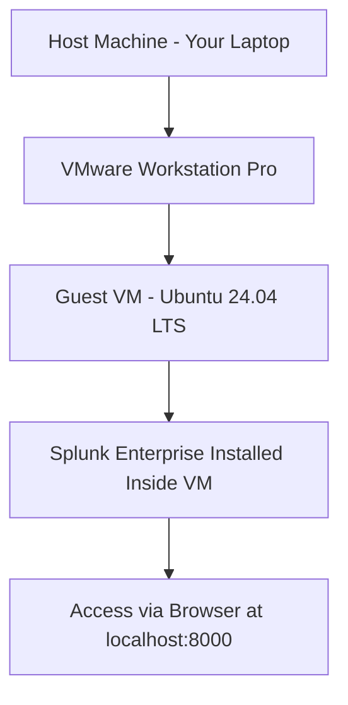
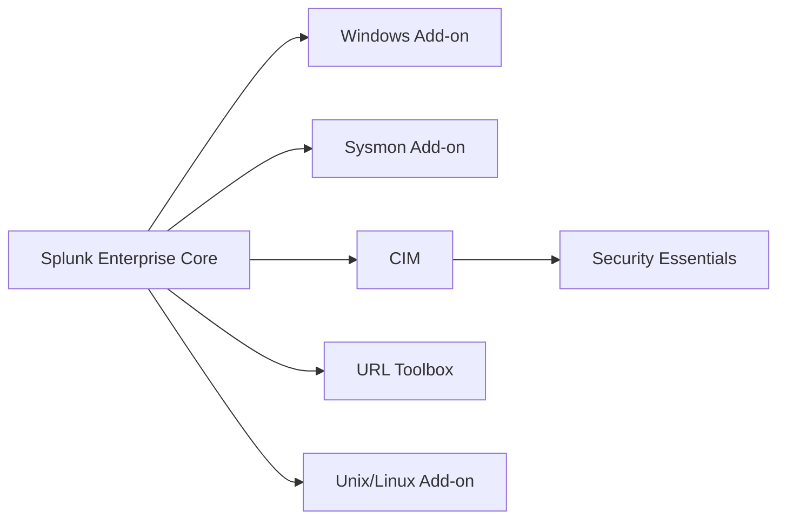

> **الهدف من الـ Section ده:**  
> هتقدر تبني بيئة SOC Lab كاملة على جهازك الشخصي باستخدام VMware و Ubuntu و Splunk Enterprise، وهتفهم إزاي الـ Components التلاتة بتاعة Splunk بتشتغل مع بعض، وتجهز نفسك عمليًا لأول Lab في الكورس.


## Table of Contents

- [Overview](#overview)
- [Lab Architecture](#lab-architecture)
- [The Three Components of Splunk](#the-three-components-of-splunk)
- [Full Lab Stack](#full-lab-stack)
- [Host Prerequisites](#host-prerequisites)
- [Part 1 — Install VMware Workstation Pro](#part-1--install-vmware-workstation-pro)
- [Part 2 — Download Ubuntu 24.04 LTS](#part-2--download-ubuntu-2404-lts)
- [Part 3 — Create the Virtual Machine](#part-3--create-the-virtual-machine)
- [Part 4 — Install Ubuntu in the VM](#part-4--install-ubuntu-in-the-vm)
- [Part 5 — Polish the VM](#part-5--polish-the-vm)
- [Part 6 — Install Splunk Enterprise](#part-6--install-splunk-enterprise)
- [Part 7 — Load the BOTS v3 Dataset](#part-7--load-the-bots-v3-dataset)
- [Part 8 — Install the Add-ons](#part-8--install-the-add-ons)
- [Part 9 — Extra Hands-on Datasets](#part-9--extra-hands-on-datasets)
- [Troubleshooting](#troubleshooting)
- [SOC Analyst Perspective](#soc-analyst-perspective)
- [Summary](#summary)

---

## Overview

في الـ Lab ده هنبني **SOC Lab Environment** كامل من الصفر على جهازك، وده هيبقى الأساس اللي هنشتغل عليه طول الكورس. الفكرة إننا هنعمل:

- **Host** (لابتوبك) بيشغل **VMware Workstation Pro**.
- جوه الـ VMware هنعمل **Guest VM** واحدة شغالة بنظام **Ubuntu Linux**.
- جوه الـ VM دي هننصب **Splunk Enterprise** ونحمّل عليه الـ Datasets.
- هنتحكم في كل حاجة من خلال المتصفح على العنوان `http://localhost:8000` جوه الـ VM.

> [!NOTE]
> الـ Session دي متوقع تاخد حوالي **3 ساعات** (منها ساعتين تقريبًا Downloads والتنصيب)، وهي شرط أساسي قبل ما تبدأ في Lab 1.

---

## Lab Architecture



---

## The Three Components of Splunk

الـ Splunk بيتكون من 3 وظائف أساسية مختلفة عن بعض. في الشركات الكبيرة، كل وظيفة بتشتغل على Server منفصل، لكن في الـ Training Lab بتاعنا، التلاتة هيشتغلوا على نفس الـ VM.

| Component | Job | What It Does |
|---|---|---|
| **Forwarder** | Collects logs | Agent خفيف بيتنصب على كل Server أو Endpoint عايز تراقبه، ووظيفته الوحيدة إنه يقرأ ملفات الـ Log ويبعتها للـ Indexer. في الكورس ده هننصب الـ **Universal Forwarder** المجاني على الـ Ubuntu VM عشان يبعت الـ Logs بتاعته لنفسه. |
| **Indexer** | Stores and processes logs | بيستقبل الـ Raw Logs من الـ Forwarders، وبيقسمها لـ Events منفصلة، وبيحط عليها Timestamp، ويستخرج منها الـ Fields، ويخزنها في صيغة مضغوطة قابلة للبحث اسمها **Index**. لما تعمل Search في Splunk، إنت فعليًا بتدور جوه اللي الـ Indexer خزنه. |
| **Search Head** | The analyst interface | الـ Web Application اللي بتفتحها على `http://localhost:8000`، وفيها بتكتب الـ Searches وتشوف الـ Dashboards والـ Reports. هو اللي بيبعت الـ Query للـ Indexer، وياخد الـ Results، ويعرضهملك. |

> [!IMPORTANT]
> في بيئة الإنتاج (Production)، ممكن مؤسسة كبيرة تشغل 20 Indexer بيخزنوا Datasets مختلفة، و5 Search Heads منفصلين. في الـ Lab بتاعنا، Splunk Enterprise واحد على VM واحدة بيقوم بالـ 3 أدوار مع بعض، وده اسمه **Standalone Deployment**.

---

## Full Lab Stack

| Layer | What It Is | Specs We'll Use |
|---|---|---|
| **Host** | لابتوبك أو جهازك الفعلي | Windows / macOS / Linux — يفضل 16 GB RAM |
| **Hypervisor** | VMware Workstation Pro (Free) | آخر إصدار (17.6.x / 25H2) |
| **Guest VM** | Ubuntu 24.04 LTS Desktop | 4 vCPU • 8 GB RAM • 60 GB Disk • NAT Network |
| **Splunk (Forwarder)** | Universal Forwarder على الـ VM | بيبعت لوجز الـ VM نفسه لـ Splunk |
| **Splunk (Indexer + Search Head)** | Splunk Enterprise على نفس الـ VM | Trial لمدة 60 يوم → بعدها 500 MB/day مجانًا |
| **Data** | BOTS v3 + tutorial data + loghub + لوجزك الخاصة | جزء منها Pre-indexed وجزء هتحمله إنت |

---

## Host Prerequisites

قبل ما تبدأ، لازم تتأكد من الآتي:

1. **مساحة فاضية**: على الأقل 60 GB على الـ Host (أو 100 GB لو هتحمّل BOTS v1 كمان).
2. **الـ RAM**: 8 GB كحد أدنى على الـ Host (وده لأنك هتدي الـ VM نفسها 8 GB، فمفضل يكون عندك 16 GB على الأقل).

> [!TIP]
> قبل ما تشغل أي VM، لازم تتأكد إن ميزة الـ **Hardware Virtualization** مفعّلة في الـ BIOS/UEFI بتاعتك. تقدر تتأكد من خلال Task Manager → Performance → CPU وشوف لو مكتوب "Virtualization: Enabled". لو مكتوب Disabled، لازم تفعّلها من إعدادات الـ Firmware — دور على اسم الجهاز/الـ Motherboard بتاعك + "enable virtualization BIOS" على جوجل.

---

## Part 1 — Install VMware Workstation Pro

من نوفمبر 2024، الـ **VMware Workstation Pro** بقى مجاني للاستخدام الشخصي من غير أي Licence Key.

### 1a. إنشاء Broadcom Account مجاني

1. روح على `support.broadcom.com` واضغط **Register**.
2. اكتب الإيميل بتاعك (Gmail أو Outlook تمام)، اعمل الـ Verification، واضغط Next.
3. ادخل الكود اللي جالك بالإيميل، اعمل Password، وكمّل تسجيل الدخول.

### 1b. تحميل الـ Installer

1. بعد تسجيل الدخول، اضغط على الـ Division Switcher فوق واختار **VMware Cloud Foundation**.
2. من القائمة الجانبية افتح **My Downloads**.
3. اضغط على لينك **"Free Software Downloads available HERE"**.
4. انزل لحد **VMware Workstation Pro** واختار نسختك (Windows `.exe` أو Linux `.bundle`).
5. اختار آخر إصدار، وافق على الشروط، واضغط أيقونة التحميل.

> [!WARNING]
> لو ظهرتلك رسالة "Not Entitled"، تأكد إنك مختار **VMware Cloud Foundation Division** وقائمة الـ **Free Downloads** مش قائمة مدفوعة. الإصدار المجاني بيبدأ من Workstation Pro 17.5.2 وما فوق.

### 1c. تشغيل الـ Installer

- **على Windows**: دبل كليك على الملف → Next → وافق على الـ Licence → كمّل الإعدادات الافتراضية → Install → Finish.
- عند أول تشغيل، هتظهرلك شاشة الـ Licensing، اختار **"Use VMware Workstation Pro for Personal Use"** واضغط Continue — من غير أي Licence Key.

---

## Part 2 — Download Ubuntu 24.04 LTS

1. افتح `ubuntu.com/download/desktop` وحمّل **Ubuntu 24.04 LTS (Noble Numbat) Desktop** — ملف `.iso` بحجم حوالي 5.8 GB.
2. لو عايز لينك مباشر أو Checksums، استخدم `releases.ubuntu.com/noble` وحمّل الملف مع `SHA256SUMS`.
3. للتأكد إن الملف سليم (اختياري بس Good Practice):

```bash
# Windows (PowerShell):
Get-FileHash .\ubuntu-24.04-desktop-amd64.iso -Algorithm SHA256

# Linux/macOS:
sha256sum ubuntu-24.04-desktop-amd64.iso
# قارن الناتج مع القيمة الموجودة في SHA256SUMS
```

---

## Part 3 — Create the Virtual Machine

1. افتح VMware Workstation Pro → **File → New Virtual Machine**.
2. اختار **Typical (recommended)** → Next.
3. اختار **"Installer disc image file (iso)"** وحدد ملف الـ Ubuntu ISO → Next (الـ VMware هيكتشف Ubuntu ويقترح Easy Install).
4. في شاشة الـ Easy Install: حدد اسمك، Username (زي `analyst`)، وPassword هتفتكره → Next.
5. سمّي الـ VM (مثلًا `SOC-Splunk-Lab`) واختار مكان الحفظ → Next.
6. حجم الـ Disk: **60 GB**، واختار **"Store virtual disk as a single file"** → Next.
7. اضغط **Customize Hardware** واضبط: **Memory 8192 MB**، **Processors 4** (أو 2 لو جهازك ضعيف)، **Network Adapter → NAT**. اقفل → Finish.

> [!TIP]
> الـ **NAT** بيخلي الـ VM توصل للإنترنت عشان التحميلات مع إنها تفضل معزولة خلف الـ Host بتاعك. الـ 8 GB RAM بتخلي Splunk يفضل سريع مع بيانات BOTS، والـ Single-file Disk أسهل في الـ Backup والنقل.

---

## Part 4 — Install Ubuntu in the VM

لو استخدمت Easy Install، الـ VMware هيعمل معظم الخطوات دي تلقائيًا:

1. شغّل الـ VM، واختار **"Try or Install Ubuntu"** من قائمة GRUB.
2. اختار اللغة والـ Keyboard، واضغط **Install Ubuntu**.
3. اختار **Normal Installation** وفعّل **"Download updates while installing"**.
4. في نوع التنصيب اختار **"Erase disk and install Ubuntu"** — آمن تمامًا، لأنه بيأثر بس على الـ 60 GB الافتراضية جوه الـ VM.
5. اضبط الـ Timezone، اعمل الـ User، واستنى التنصيب (10-20 دقيقة تقريبًا).
6. لما يطلب **Restart**، اعمله. لو علّق على رسالة "remove the installation medium"، دوس Enter عادي.
7. سجّل دخولك على الـ Ubuntu Desktop الجديد.

---

## Part 5 — Polish the VM

افتح Terminal جوه Ubuntu (Activities → اكتب "Terminal") ونفّذ:

```bash
sudo apt update && sudo apt -y upgrade
sudo apt install -y open-vm-tools open-vm-tools-desktop curl wget tar
sudo reboot
```

> [!TIP]
> بعد كده خد **Snapshot** فورًا: VM → Snapshot → Take Snapshot، وسمّيها "Clean Ubuntu". الـ Snapshots بتخليك ترجع للحالة دي في ثواني لو أي حاجة اتكسرت بعدين — خد Snapshot بعد كل مرحلة مهمة (OS نظيف، Splunk اتنصب، BOTS اتحمّل).

---

## Part 6 — Install Splunk Enterprise

1. جوه الـ VM، افتح Firefox وسجّل / اعمل Account مجاني على `splunk.com` → Download → Splunk Enterprise.
2. اختار **Linux → .tgz**، واستخدم خيار **"Download via Command Line (wget)"** لنسخ أمر الـ wget الجاهز.

```bash
# الصق أمر الـ wget اللي Splunk دهولك، مثال:
cd ~/Downloads
wget -O splunk.tgz "PASTE_THE_SPLUNK_LINUX_TGZ_URL_HERE"

# التنصيب في /opt (مملوك للـ root)
sudo tar xvzf splunk.tgz -C /opt

# تشغيل Splunk كـ root، والموافقة على الـ Licence
sudo /opt/splunk/bin/splunk start --accept-license --run-as-root
# -> هيطلب منك تعمل admin username + password

# التشغيل التلقائي عند الإقلاع، بصلاحيات root
sudo /opt/splunk/bin/splunk enable boot-start -user root
```

> [!WARNING]
> لو ظهرلك خطأ **"Permission denied"** بعد التنصيب، ده غالبًا لأن خطوة اتقطعت أو Splunk اتشغل قبل كده بـ User مختلف. اعمل Reset كامل بالخطوات دي:

```bash
sudo pkill -9 -f splunk                                # وقف أي Splunk processes عالقة
sleep 3
sudo chown -R root:root /opt/splunk                    # خلي root يملك كل ملفات Splunk
sudo chmod -R 755 /opt/splunk                           # صلاحيات القراءة والتشغيل
sudo rm -f /opt/splunk/var/run/splunk/splunkd.pid       # امسح أي pid file قديم
sudo /opt/splunk/bin/splunk start --run-as-root
```

> [!TIP]
> للتأكد إن الـ Ownership اتظبط فعلًا، نفّذ:
> `sudo find /opt/splunk ! -user root -print`
> لو الأمر رجع من غير أي نتيجة، يبقى كل حاجة تمام. أي ملف يظهر يبقى لسه مش مملوك للـ root الصحيح.

بعد كده افتح Firefox على `http://localhost:8000` وسجّل دخول بالـ Admin Account اللي عملته.

> [!WARNING]
> لو هتوصل لـ Splunk من متصفح الـ Host مش من جوه الـ VM، لازم تسمح بالـ Port في الـ VM:
> `sudo ufw allow 8000/tcp`

---

## Part 7 — Load the BOTS v3 Dataset

بيانات **BOTS** بتتنصب زي أي App، عن طريق فك الضغط جوه فولدر Apps بتاع Splunk وعمل Restart. وبما إنها Pre-indexed، فهي مش بتحسب من الـ 500 MB/day المجانية.

```bash
cd /opt/splunk/etc/apps
sudo wget -O botsv3.tgz "https://botsdataset.s3.amazonaws.com/botsv3/botsv3_data_set.tgz"
md5sum botsv3.tgz   # المفروض يطابق: d7ccca99a01cff070dff3c139cdc10eb
sudo tar xvzf botsv3.tgz
sudo /opt/splunk/bin/splunk restart --run-as-root
```

للتأكد في Splunk Web → Search & Reporting (واضبط الـ Time Picker على **All time**):

```spl
index=botsv3 earliest=0
| stats count by sourcetype
| sort - count
```

المفروض تشوف حوالي 100 Sourcetype وملايين الـ Events.

> [!WARNING]
> لو رجعلك 0 نتائج، غالبًا السبب هو الـ Time Picker. بيانات BOTS من سنة 2018، فالبحث الافتراضي "Last 24 hours" مش هيرجع حاجة. استخدم دايمًا **All time** أو ضيف `earliest=0`.

---

## Part 8 — Install the Add-ons

Splunk لوحده بيقدر يخزن ويدور في الـ Raw Logs، لكنه مش فاهم تلقائيًا طبيعة الـ Security Data. الـ **Add-ons** هي تطبيقات صغيرة مجانية من Splunkbase بتعلّم Splunk إزاي يقرأ نوع معين من البيانات — بتستخرج الـ Fields الصح، وتديها أسماء موحدة، وأحيانًا بتضيف Detections و Dashboards جاهزة.

### طريقة تنصيب أي Add-on

1. من Splunk Web، اضغط على أيقونة الـ Gear/Apps (فوق شمال) → **Find More Apps**.
2. اكتب اسم الـ Add-on في خانة البحث.
3. اضغط **Install** جنب النتيجة الصحيحة.
4. سجّل دخول بحساب Splunkbase (نفس حساب splunk.com).
5. اضغط **Restart** لو Splunk طلب كده.

### الـ Add-ons المطلوبة

| # | Add-on | ليه محتاجه |
|---|---|---|
| 1 | **Splunk Add-on for Microsoft Windows** | بيفكّك الـ Windows Event Logs (Logons, Account Changes, Process Events...). أغلب بيانات BOTS وشغل الـ SOC الحقيقي مبني على Windows. |
| 2 | **Splunk Add-on for Sysmon** | بيفكّك بيانات الـ Sysmon (تفاصيل دقيقة عن الـ Processes وأوامرها). ده اللي بيخليك تمسك نشاط المهاجم على الجهاز نفسه، مش بس تسجيل الدخول. |
| 3 | **Splunk Common Information Model (CIM)** | أهمهم كلهم — بيوحّد أسماء الـ Fields عبر كل المنتجات (زي `src_ip`) عشان تقدر تعمل Search واحد يشتغل على كل المصادر. أي App تاني (زي SSE) مش هيشتغل من غيره. |
| 4 | **Splunk Security Essentials (SSE)** | App مجاني فيه مئات الـ Detections الجاهزة والموثّقة، متربطة بـ **MITRE ATT&CK Framework**. |
| 5 | **URL Toolbox** | بيضيف Functions لتحليل الدومينات والـ URLs، أهمها حساب الـ **Shannon Entropy** لاكتشاف الدومينات العشوائية (اللي المالوير بيستخدمها). |
| 6 | **Splunk Add-on for Unix and Linux** | بيفكّك لوجز Linux/Unix (زي `/var/log/auth.log`)، وده اللي هيخليك تقدر تكشف SSH Brute Force من لوجز الـ VM بتاعتك في Lab 1. |

> [!TIP]
> رتب التنصيب بحيث تنصب **CIM قبل Security Essentials**، لأن SSE بيعتمد عليه. الباقي ترتيبه مش مهم. لو لاحظت Field متوقعها (زي `user` أو `src_ip`) مش ظاهرة، السبب الغالب إنك ناسي تنصب Add-on معين أو ناسي تعمل Restart.



---

## Part 9 — Extra Hands-on Datasets

BOTS v3 هو الـ Dataset الأساسي المطلوب قبل Lab 1، لكن فيه Datasets تانية هتحتاجها في Labs مختلفة.

| Dataset | Purpose | When to Get It |
|---|---|---|
| **BOTS v3** | الـ Incident الأساسي المُقيَّم | خلاص خلصناه (Part 7) — مطلوب لكل الـ Labs |
| **Splunk Tutorial Data** | أول تجربة Ingestion وSPL Practice | قبل Lab 1 |
| **loghub** (Linux/SSH/Apache) | تحليل لوجز Linux وWeb حقيقية | قبل Lab 1 (Linux/SSH) وLab 5 (Apache) |
| **attack_data** | اختبار Detections تقنية بتقنية | قبل Lab 6 |
| **BOTS v1 (اختياري)** | سيناريو Web-attack إضافي | لو عايز تدريب زيادة بس |

> [!NOTE]
> مش لازم تحمّل كل حاجة دلوقتي؛ الـ Datasets صغيرة وممكن تحملها بالليل قبل الـ Lab اللي هتستخدمها فيه مباشرة.

- **Splunk Tutorial Data**: نزّل ملف `tutorialdata.zip` من صفحة الـ Search Tutorial، ومتفكّوش — Splunk بياخده كـ `.zip` مباشرة، وهترفعه في Lab 1 من `Settings → Add Data → Upload`.
- **loghub**: نزّل 3 عينات صغيرة (Linux log، OpenSSH log، Apache log) وهي عادة نصوص عادية جاهزة.
- **attack_data**: مش محتاج الـ Repo كله؛ بس شوف شكله واحفظ اسم تقنية زي `T1059.001` (PowerShell خبيث) وهتنزل الملف بتاعها وقت Lab 6.
- **BOTS v1**: اختياري تمامًا، تقدر تتجاهله لو مش عندك وقت أو مساحة.

> [!TIP]
> متحملش الـ **Universal Forwarder** دلوقتي — Lab 1 هيوريك إمتى بالظبط تحمله وتنصبه.

---

## Troubleshooting

| Symptom | Fix |
|---|---|
| الـ VM مش عايزة تشتغل / "VT-x disabled" | فعّل Intel VT-x أو AMD-V من BIOS/UEFI، وأعد تشغيل الـ Host |
| الـ VM بطيئة جدًا | تأكد إن الـ Virtualization مفعّلة، وزود عدد الـ vCPU لـ 4 |
| شاشة سودا / دقة غلط | نصّب `open-vm-tools-desktop` واعمل Reboot |
| مفيش Clipboard/Drag-drop | نفس الحل، `open-vm-tools-desktop` غير منصب أو محتاج Reboot |
| BOTS بيرجع 0 Events | غيّر الـ Time Picker لـ **All time** أو ضيف `earliest=0` |
| Fields أو Sourcetype ناقصة | Add-on مش منصب أو Splunk مش عمله Restart بعد تحميل البيانات |
| مش قادر توصل لـ `localhost:8000` | Splunk مش شغال — نفّذ `sudo /opt/splunk/bin/splunk start --run-as-root` |
| "Permission denied" على ملفات الـ log/pid | مشكلة Ownership — اعمل الـ Full Reset في Part 6 |
| "Not Entitled" على Broadcom | تأكد إنك في `VMware Cloud Foundation` → Free Downloads |

---

## SOC Analyst Perspective

> [!IMPORTANT]
> الـ Lab ده مش مجرد تمرين تقني؛ هو أساس أي شغل SOC حقيقي. في الواقع، أي Analyst بيتعامل يوميًا مع بيئة فيها **Forwarders** بتجمع اللوجز، **Indexers** بتخزنها، و**Search Heads** بتحلل فيها. فهمك للـ Architecture ده من دلوقتي هيسهّلك جدًا لما تشتغل على SIEM حقيقي في شركة، وهيخليك تفهم ليه بعض الـ Searches بتاخد وقت (لو الـ Indexers كتير) أو ليه فيه Latency في وصول اللوجز (مشكلة في الـ Forwarder).

- الـ **Add-ons** زي CIM و Security Essentials هي نفس الأدوات اللي بتتستخدم في بيئات SOC حقيقية عشان تربط الـ Detections بـ **MITRE ATT&CK**.
- تجربة تحميل BOTS وتحليلها هي بالظبط نفس اللي هتعمله لما تحقق في Incident حقيقي — تدور في الـ Logs، تربط بين الـ Events، وتبني Timeline.
- عادة الـ **Snapshots** اللي بتاخدها في VMware هي مبدأ شبيه بمبدأ الـ **Forensic Imaging** في الـ Digital Forensics — بتحافظ على نسخة نظيفة ترجعلها وقت الحاجة.

---

## Summary

- بنينا بيئة SOC Lab كاملة: **Host** بيشغل **VMware Workstation Pro**، جواه **Ubuntu VM**، وجوه الـ VM دي **Splunk Enterprise**.
- Splunk بيتكون من 3 Components أساسية: **Forwarder** (بيجمع اللوجز)، **Indexer** (بيخزن ويعالج)، **Search Head** (واجهة الـ Analyst). في الـ Lab التلاتة شغالين على نفس الـ VM (Standalone Deployment).
- الخطوات الأساسية كانت: تنصيب VMware → تحميل Ubuntu → عمل الـ VM → تنصيب Ubuntu → تنصيب Splunk Enterprise → تحميل BOTS v3 → تنصيب الـ Add-ons المطلوبة → معرفة الـ Datasets الإضافية ومتى نجيبها.
- الـ **Add-ons** (Windows, Sysmon, CIM, Security Essentials, URL Toolbox, Unix/Linux) هي اللي بتخلي Splunk يفهم البيانات الأمنية ويطلع منها Fields واضحة بدل نص خام.
- خد بالك دايمًا من مشكلة الـ **Time Picker** لما تدور في بيانات BOTS (استخدم All time أو `earliest=0`)، ومن مشاكل الـ **Permissions** بعد تنصيب Splunk.
- لما تخلص كل الخطوات دي وتاخد Snapshot اسمه "Ready for Lab 1"، تبقى جاهز تمامًا تبدأ أول Lab عملي في الكورس.
