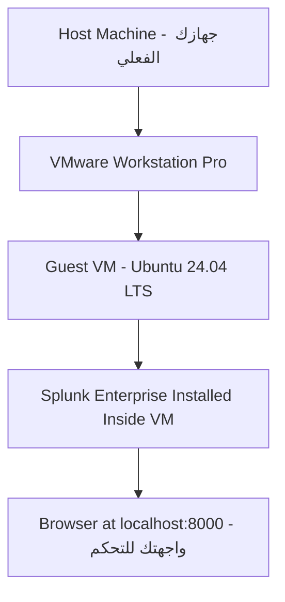
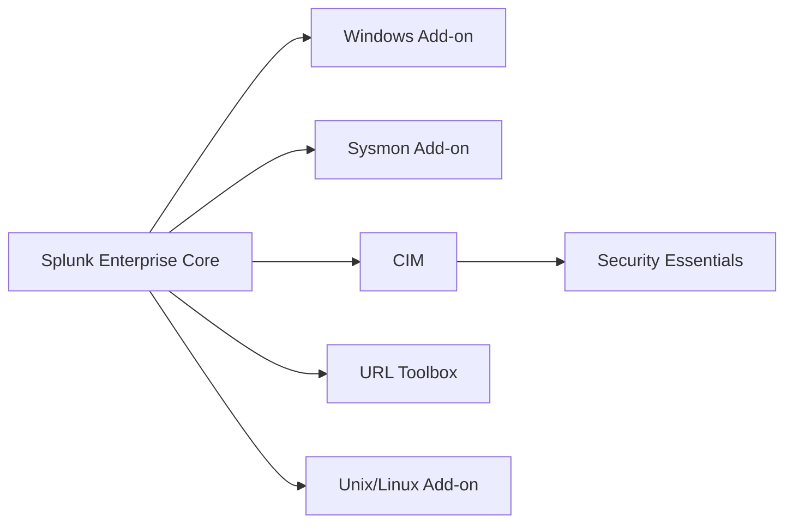

> **الهدف من الـ Section ده:**  
> هتقدر تبني بيئة SOC Lab كاملة على جهازك الشخصي باستخدام VMware و Ubuntu و Splunk Enterprise، وهتفهم إزاي الـ Components التلاتة بتاعة Splunk بتشتغل مع بعض، وتجهز نفسك عمليًا لأول Lab في الكورس.

## Table of Contents

- [Pre-Flight Checklist](#pre-flight-checklist)
- [What You're Building (Architecture)](#what-youre-building-architecture)
- [The Three Components of Splunk](#the-three-components-of-splunk)
- [Full Lab Stack](#full-lab-stack)
- [Step 1 — Install VMware Workstation Pro](#step-1--install-vmware-workstation-pro)
- [Step 2 — Download Ubuntu 24.04 LTS](#step-2--download-ubuntu-2404-lts)
- [Step 3 — Create the Virtual Machine](#step-3--create-the-virtual-machine)
- [Step 4 — Install Ubuntu Inside the VM](#step-4--install-ubuntu-inside-the-vm)
- [Step 5 — Polish the VM (Tools + Updates)](#step-5--polish-the-vm-tools--updates)
- [Step 6 — Install Splunk Enterprise](#step-6--install-splunk-enterprise)
- [Step 7 — Load the BOTS v3 Dataset](#step-7--load-the-bots-v3-dataset)
- [Step 8 — Install the Required Add-ons](#step-8--install-the-required-add-ons)


---

## Pre-Flight Checklist

قبل ما تفتح أي برنامج، اتأكد من الـ 3 نقط دي — لو حاجة منهم ناقصة، الـ Lab كله ممكن يقف:

| # | Check | Minimum | كيف تتأكد |
|---|---|---|---|
| 1 | مساحة فاضية على الـ Host | 60 GB (100 GB لو هتحمل BOTS v1 كمان) | افتح File Explorer / Finder وشوف مساحة الـ Disk |
| 2 | الـ RAM على الـ Host | 8 GB (يفضل 16 GB) | هتدي الـ VM 8 GB لوحدها، فلو عندك 8 GB بس هيبقى فيه ضغط |
| 3 | الـ Virtualization مفعّلة في الـ BIOS/UEFI | Enabled | Task Manager → Performance → CPU → دور على "Virtualization" |

> [!WARNING]
> لو البند التالت (Virtualization) مش Enabled، **متكملش** لحد ما تفعّله من الـ BIOS/UEFI. من غيره الـ VM مش هتشتغل نهائي مهما عملت. دور على "اسم اللابتوب/الموذربورد بتاعك + enable virtualization BIOS" على جوجل، كل شركة بتحط الخيار في مكان مختلف.

---

## What You're Building (Architecture)

إحنا مش هننصب Splunk على جهازك مباشرة؛ هنبني طبقات فوق بعض عشان لو أي حاجة اتكسرت، تقدر ترجع لنسخة نظيفة من غير ما تلمس جهازك الحقيقي.



**يعني إيه ده عمليًا؟**

- **الـ Host** هو لابتوبك زي ما هو، من غير أي تعديل عليه.
- **VMware** هو "الصندوق" اللي هيشغل جهاز وهمي كامل جوه جهازك.
- **الـ VM** دي جهاز Ubuntu كامل، منعزل، لو اتكسر تقدر تمسحه وتعمله من جديد من غير ما تأثر على جهازك.
- **Splunk** هيتنصب جوه الـ VM دي بس، مش على جهازك الحقيقي.
- هتتحكم في كل حاجة من متصفحك العادي (Firefox جوه الـ VM) عن طريق فتح `localhost:8000`.

---

## The Three Components of Splunk

قبل ما تنصب أي حاجة، لازم تفهم إن Splunk مش برنامج واحد — هو 3 وظائف مختلفة بتشتغل مع بعض. في شركة كبيرة، كل وظيفة بتقعد على Server منفصل تمامًا؛ في الـ Lab بتاعك التلاتة هيشتغلوا على نفس الـ VM الواحدة.

| Component | Job | إيه اللي بيعمله فعليًا |
|---|---|---|
| **Forwarder** | بيجمع اللوجز | Agent خفيف بيتنصب على أي جهاز عايز تراقبه. مفيش عنده ذكاء، شغلته بس إنه يقرأ ملفات الـ Log ويبعتها للـ Indexer. هننصب منه نسخة اسمها **Universal Forwarder** على نفس الـ VM بتاعتنا. |
| **Indexer** | بيخزن ويعالج اللوجز | بياخد اللوجز الخام من الـ Forwarder، يقسمها لـ Events منفصلة، يحط عليها Timestamp، يستخرج منها Fields، ويخزنها في صيغة مضغوطة قابلة للبحث اسمها **Index**. لما تعمل Search، إنت فعليًا بتدور جوه اللي الـ Indexer خزنه، مش جوه الملف الخام. |
| **Search Head** | واجهة الـ Analyst | الصفحة اللي بتفتحها على `localhost:8000`. هي اللي بتاخد الـ Query اللي بتكتبه، تبعته للـ Indexer، تجيب الـ Results، وتعرضهملك كـ Table أو Chart. |

> [!IMPORTANT]
> في بيئة إنتاج حقيقية، ممكن تلاقي 20 Indexer و5 Search Heads كل واحد على Server لوحده. إحنا هنا بنعمل **Standalone Deployment**: Splunk واحد بيقوم بالـ 3 أدوار مع بعض على نفس الجهاز. ده مناسب للتعلم بس، مش لبيئة إنتاج حقيقية.

---

## Full Lab Stack

الجدول ده ملخص لكل حاجة هتستخدمها، عشان يكون قدامك مرجع سريع أثناء التنفيذ:

| Layer | What It Is | Specs We'll Use |
|---|---|---|
| Host | جهازك الفعلي | Windows / macOS / Linux، 16 GB RAM يفضل |
| Hypervisor | VMware Workstation Pro (Free) | آخر إصدار 17.6.x / 25H2 |
| Guest VM | Ubuntu 24.04 LTS Desktop | 4 vCPU • 8 GB RAM • 60 GB Disk • NAT |
| Splunk (Forwarder) | Universal Forwarder جوه الـ VM | بيبعت لوجز الـ VM نفسها |
| Splunk (Indexer + Search Head) | Splunk Enterprise على نفس الـ VM | Trial 60 يوم → بعدها 500 MB/day مجانًا |
| Data | BOTS v3 + Tutorial + loghub + لوجزك الخاصة | جزء Pre-indexed وجزء هتحمله إنت بنفسك |

---

## Step 1 — Install VMware Workstation Pro

**الهدف من الخطوة دي:** تحصل على البرنامج اللي هيشغل الـ VM بتاعتك، مجانًا وبدون Licence Key.

### 1.1 اعمل Broadcom Account

بما إن VMware بقت تابعة لـ Broadcom، محتاج تعمل Account مجاني عندهم الأول عشان تقدر تحمّل البرنامج:

1. روح `support.broadcom.com` واضغط **Register**.
2. اكتب إيميلك (Gmail/Outlook تمام)، اعمل الـ Verification، اضغط Next.
3. ادخل كود التفعيل اللي هيجيلك بالإيميل، اعمل Password، وسجّل دخولك.

### 1.2 حمّل الـ Installer

الخطوة دي بتاخدك للمكان الصح بالظبط عشان تلاقي النسخة المجانية (مش نسخة مدفوعة بالغلط):

1. بعد تسجيل الدخول، اضغط الـ Division Switcher فوق واختار **"VMware Cloud Foundation"**.
2. من القائمة الجانبية افتح **My Downloads**.
3. اضغط لينك **"Free Software Downloads available HERE"**.
4. انزل لحد **VMware Workstation Pro** واختار نسختك: Windows (`.exe`) أو Linux (`.bundle`).
5. اختار آخر إصدار، وافق على الشروط، واضغط أيقونة التحميل.

> [!WARNING]
> لو ظهرتلك رسالة **"Not Entitled"**، معناها إنك مش واقف في القسم الصح. ارجع تأكد إنك دخلت **VMware Cloud Foundation** واخترت قائمة **Free Downloads**، مش أي قائمة تانية. النسخة المجانية شغالة بس من Workstation Pro 17.5.2 وما فوق.

### 1.3 نصّب البرنامج

على Windows: دبل كليك على `.exe` → Next → وافق على الـ Licence → كمّل الإعدادات الافتراضية → Install → Finish.

عند أول تشغيل، هتظهرلك شاشة Licensing — اختار **"Use VMware Workstation Pro for Personal Use"** واضغط Continue. مفيش Licence Key مطلوب خالص.

✅ **Checkpoint:** لو فتحت البرنامج وطلع قدامك شاشة "Create a New Virtual Machine"، يبقى الخطوة دي خلصت صح.

---

## Step 2 — Download Ubuntu 24.04 LTS

**الهدف من الخطوة دي:** تحصل على نسخة الـ Linux اللي هتتنصب جوه الـ VM.

1. افتح `ubuntu.com/download/desktop` وحمّل **Ubuntu 24.04 LTS (Noble Numbat) Desktop** — ملف `.iso` حجمه تقريبًا 5.8 GB.
2. لو عايز لينك مباشر أو Checksums، استخدم `releases.ubuntu.com/noble` وحمّل `ubuntu-24.04.x-desktop-amd64.iso` مع `SHA256SUMS`.

### تحقق من سلامة الملف (اختياري بس مفيد)

الخطوة دي بتتأكد إن الملف اللي نزل عندك مطابق تمامًا للأصلي ومحصلش فيه أي تلف أثناء التحميل:

```bash
# على Windows (PowerShell):
Get-FileHash .\ubuntu-24.04-desktop-amd64.iso -Algorithm SHA256

# على Linux/macOS:
sha256sum ubuntu-24.04-desktop-amd64.iso
# قارن الناتج بالقيمة الموجودة في SHA256SUMS
```

لو الـ Hash اللي طلع مطابق للي موجود في `SHA256SUMS`، يبقى الملف سليم 100%.

✅ **Checkpoint:** عندك دلوقتي ملف `.iso` بحجم ~5.8 GB جاهز، والـ Hash (لو عملته) متطابق.

---

## Step 3 — Create the Virtual Machine

**الهدف من الخطوة دي:** تبني "الجهاز الوهمي" اللي هيشغل Ubuntu، بمواصفات محددة تناسب Splunk.

1. افتح VMware Workstation Pro → **File → New Virtual Machine**.
2. اختار **Typical (recommended)** → Next.
3. اختار **"Installer disc image file (iso)"** وحدد ملف الـ Ubuntu ISO → Next. (الـ VMware هيتعرف على Ubuntu لوحده ويعرض عليك Easy Install).
4. في شاشة Easy Install: حدد اسمك، Username (مثلًا `analyst`)، وPassword هتفتكره → Next.
5. سمّي الـ VM (مثلًا `SOC-Splunk-Lab`) واختار مكان الحفظ على الـ Disk → Next.
6. حجم الـ Disk: **60 GB**، واختار **"Store virtual disk as a single file"** → Next.
7. اضغط **Customize Hardware** واضبط:
   - **Memory:** 8192 MB
   - **Processors:** 4 (أو 2 لو جهازك ضعيف)
   - **Network Adapter:** NAT
   
   اقفل النافذة → Finish.

> [!TIP]
> **ليه بالظبط الإعدادات دي؟**
> - **NAT**: بيدي الـ VM اتصال بالإنترنت (للتحميلات) لكنها تفضل معزولة خلف جهازك الحقيقي — يعني حد بره مايقدرش يوصلها مباشرة.
> - **8 GB RAM**: Splunk محتاج ذاكرة كافية عشان يفضل سريع وهو بيعالج بيانات BOTS الكبيرة.
> - **Single-file Disk**: أسهل في الـ Backup والنقل من مكان لمكان لو حبيت تاخد نسخة من الـ VM كلها.

✅ **Checkpoint:** لسه الـ VM متعملتلهاش تشغيل؛ إنت بس جهزت "الصندوق الفاضي" بالمواصفات الصح، جاهز نحط جواه Ubuntu في الخطوة الجاية.

---

## Step 4 — Install Ubuntu Inside the VM

**الهدف من الخطوة دي:** تشغّل الـ VM لأول مرة وتخلص تنصيب نظام Ubuntu فعليًا جواها.

لو استخدمت Easy Install في الخطوة اللي فاتت، الـ VMware هيعمل الخطوات دي شبه أوتوماتيك — بس تابع وأكد على الإعدادات الافتراضية. لو حصل يدوي:

1. شغّل الـ VM، ومن قائمة GRUB اختار **"Try or Install Ubuntu"**.
2. اختار اللغة والـ Keyboard Layout، واضغط **Install Ubuntu**.
3. اختار **Normal Installation** وفعّل **"Download updates while installing"**.
4. في نوع التنصيب اختار **"Erase disk and install Ubuntu"**.

> [!NOTE]
> الخيار ده اسمه مخيف ("Erase Disk") بس هو آمن 100% في حالتنا، لأنه بيمسح بس الـ **Virtual Disk** المساحة الـ 60 GB اللي عملتها جوه الـ VM — مش هيلمس الـ Disk الحقيقي بتاع لابتوبك خالص.

5. اضبط الـ Timezone، اعمل حساب الـ User (نفس بيانات Easy Install لو استخدمتها)، واستنى التنصيب (10-20 دقيقة).
6. لما يطلب **Restart**، اعمله. لو علّق على رسالة "Please remove the installation medium"، دوس Enter عادي (VMware بتشيل الـ ISO تلقائيًا).
7. سجّل دخولك على سطح مكتب Ubuntu الجديد.

✅ **Checkpoint:** لو شفت سطح مكتب Ubuntu وقدرت تسجل دخول بالـ Username والـ Password اللي عملتهم، يبقى عندك نظام تشغيل كامل شغال جوه الـ VM.

---

## Step 5 — Polish the VM (Tools + Updates)

**الهدف من الخطوة دي:** تحدّث النظام وتنصب أدوات الـ VMware اللي بتحسن تجربة الاستخدام (زي مشاركة الـ Clipboard وتغيير حجم الشاشة تلقائي).

افتح Terminal جوه Ubuntu (Activities → اكتب "Terminal") ونفّذ:

```bash
sudo apt update && sudo apt -y upgrade
sudo apt install -y open-vm-tools open-vm-tools-desktop curl wget tar
sudo reboot
```

**إيه اللي الأوامر دي بتعمله بالظبط؟**

| الأمر | بيعمل إيه |
|---|---|
| `sudo apt update` | بيحدّث قائمة الـ Packages المتاحة من مصادر Ubuntu |
| `sudo apt -y upgrade` | بيرقّي كل الـ Packages المنصبة لآخر إصدار، من غير ما يسألك تأكيد (`-y`) |
| `apt install open-vm-tools...` | بينصب أدوات الـ VMware اللي بتخلي الـ Clipboard يشتغل بين جهازك والـ VM، والشاشة تتظبط تلقائي |
| `sudo reboot` | بيعيد تشغيل الـ VM عشان التحديثات تتفعّل |

> [!TIP]
> بعد ما الـ VM ترجع تشتغل، خد **Snapshot** فورًا: من قائمة VMware، **VM → Snapshot → Take Snapshot**، وسمّيها `"Clean Ubuntu"`.
>
> **الـ Snapshot ده معناه إيه عمليًا؟** هو زي "نسخة احتياطية مجمّدة" من حالة الـ VM دلوقتي. لو أي حاجة اتكسرت بعدين (Splunk اتعطل، ملف اتمسح غلط...)، تقدر ترجع بالـ VM بالظبط للحالة دي في ثواني من غير ما تعمل التنصيب كله تاني. خد Snapshot جديد بعد كل مرحلة مهمة (دلوقتي، وبعد تنصيب Splunk، وبعد تحميل BOTS).

✅ **Checkpoint:** النظام محدّث، أدوات VMware شغالة (جرب تعمل Resize للنافذة وشوف لو الشاشة جوه الـ VM بتتظبط تلقائي)، وعندك Snapshot اسمه "Clean Ubuntu".

---

## Step 6 — Install Splunk Enterprise

**الهدف من الخطوة دي:** تنصب Splunk نفسه جوه الـ VM، وتشغّله، وتوصله من المتصفح.

### 6.1 حمّل Splunk

1. جوه الـ VM، افتح Firefox وسجّل / اعمل Account مجاني على `splunk.com` → Download → Splunk Enterprise.
2. اختار **Linux → .tgz**، واستخدم خيار **"Download via Command Line (wget)"** عشان تاخد أمر الـ wget الجاهز (فيه فيه رابط تحميل مؤقت خاص بحسابك).

### 6.2 نصّب وشغّل Splunk

```bash
# الصق أمر الـ wget اللي Splunk دهولك، مثال:
cd ~/Downloads
wget -O splunk.tgz "PASTE_THE_SPLUNK_LINUX_TGZ_URL_HERE"

# التنصيب في /opt (المكان القياسي للبرامج الكبيرة على Linux، ومملوك للـ root)
sudo tar xvzf splunk.tgz -C /opt

# تشغيل Splunk كـ root، والموافقة على الـ Licence
sudo /opt/splunk/bin/splunk start --accept-license --run-as-root
# -> هيطلب منك تعمل admin username + password دلوقتي، افتكرهم كويس

# خلي Splunk يشتغل تلقائي عند أي إعادة تشغيل للـ VM
sudo /opt/splunk/bin/splunk enable boot-start -user root
```

**إيه اللي الأوامر دي بتعمله بالظبط؟**

| الأمر | بيعمل إيه |
|---|---|
| `wget -O splunk.tgz "..."` | بيحمّل ملف Splunk المضغوط ويسميه `splunk.tgz` |
| `sudo tar xvzf splunk.tgz -C /opt` | بيفك الضغط (`x`=extract، `v`=verbose يعرض التقدم، `z`=gzip، `f`=اسم الملف) ويحط الناتج في `/opt` |
| `splunk start --accept-license --run-as-root` | بيشغّل Splunk فعليًا، ويوافق على الـ Licence تلقائيًا، وبيشغله بصلاحيات root |
| `splunk enable boot-start` | بيسجل Splunk كـ Service بيشتغل لوحده كل ما الـ VM تشتغل، من غير ما تحتاج تشغّله يدوي كل مرة |

> [!WARNING]
> لو ظهرلك خطأ **"Permission denied"** بعد التنصيب، ده غالبًا معناه إن خطوة اتقطعت في النص، أو إن Splunk اتشغل قبل كده بـ User مختلف عن اللي إنت بتستخدمه دلوقتي. اعمل **Reset كامل** بالخطوات دي:

```bash
sudo pkill -9 -f splunk                                # وقف أي Splunk processes عالقة بالقوة
sleep 3                                                 # استنى 3 ثواني عشان تتأكد إنها وقفت فعلًا
sudo chown -R root:root /opt/splunk                    # خلي root يملك كل ملفات Splunk من غير استثناء
sudo chmod -R 755 /opt/splunk                           # اضبط صلاحيات القراءة والتشغيل الصحيحة
sudo rm -f /opt/splunk/var/run/splunk/splunkd.pid       # امسح أي ملف pid قديم عالق ممكن يمنع التشغيل
sudo /opt/splunk/bin/splunk start --run-as-root         # حاول تشغل تاني من الأول
```

> [!TIP]
> للتأكد إن الـ Ownership اتظبط فعلًا بعد الـ Reset، نفّذ:
> ```bash
> sudo find /opt/splunk ! -user root -print
> ```
> لو الأمر رجّع من غير أي سطر، يبقى كل حاجة تمام. أي مسار يظهر في النتيجة يبقى لسه مش مملوك للـ root الصح، وتحتاج تعيد الـ `chown` تاني.

### 6.3 افتح Splunk من المتصفح

افتح Firefox جوه الـ VM على `http://localhost:8000` وسجّل دخول بالـ Admin Account اللي عملته.

> [!WARNING]
> لو هتوصل لـ Splunk من متصفح الـ **Host** (جهازك الحقيقي) مش من جوه الـ VM، لازم تسمح بالـ Port الأول جوه الـ VM:
> ```bash
> sudo ufw allow 8000/tcp
> ```
> في بيئة Lab معزولة، ممكن كمان تسيب الـ `ufw` (Firewall بتاع Ubuntu) متوقف تمامًا.

✅ **Checkpoint:** لو صفحة تسجيل الدخول بتاعة Splunk ظهرت على `localhost:8000` وقدرت تدخل بالـ Admin Account، يبقى Splunk شغال بنجاح.

---

## Step 7 — Load the BOTS v3 Dataset

**الهدف من الخطوة دي:** تحمّل الـ Dataset الرئيسي اللي هتشتغل عليه طول الكورس (بيانات جاهزة ومفهرسة مسبقًا).

بيانات **BOTS** بتتنصب زي أي App عادي في Splunk — فك ضغط جوه فولدر Apps بتاعه، وعمل Restart. وبما إنها **Pre-indexed** (متفهرسة من الأول)، فهي مش بتحسب من حد الـ 500 MB/day المجانية بتاعتك.

```bash
cd /opt/splunk/etc/apps
sudo wget -O botsv3.tgz "https://botsdataset.s3.amazonaws.com/botsv3/botsv3_data_set.tgz"
md5sum botsv3.tgz   # المفروض يطابق: d7ccca99a01cff070dff3c139cdc10eb
sudo tar xvzf botsv3.tgz
sudo /opt/splunk/bin/splunk restart --run-as-root
```

**إيه اللي بيحصل هنا؟**

1. بتنزل الـ Dataset في نفس فولدر `apps` بتاع Splunk (`/opt/splunk/etc/apps`).
2. `md5sum` بيتأكد إن الملف نزل كامل وسليم من غير تلف — لو الناتج مطابق للقيمة المكتوبة، الملف تمام.
3. فك الضغط بيحط بيانات BOTS في مكانها الصحيح كـ "App" داخل Splunk.
4. الـ Restart ضروري عشان Splunk "يشوف" الـ App الجديد ويحمّل بياناته.

### تحقق إن البيانات اتحمّلت صح

روح على Splunk Web → **Search & Reporting**، واضبط الـ Time Picker على **All time**، ونفّذ:

```spl
index=botsv3 earliest=0
| stats count by sourcetype
| sort - count
```

المفروض تشوف حوالي 100 Sourcetype وملايين الـ Events.

> [!WARNING]
> لو رجعلك **0 نتائج**، السبب في 95% من الحالات هو الـ **Time Picker**. بيانات BOTS تاريخها من سنة 2018، فالبحث الافتراضي "Last 24 hours" مش هيرجّع حاجة. استخدم دايمًا **All time** أو ضيف `earliest=0` في نهاية الـ Search.

✅ **Checkpoint:** الـ Search رجّع أرقام كبيرة (ملايين الـ Events) وحوالي 100 Sourcetype مختلف. لو رجّع صفر، ارجع للتحذير فوق.

---

## Step 8 — Install the Required Add-ons

**الهدف من الخطوة دي:** تخلي Splunk يفهم طبيعة البيانات الأمنية (Windows Logs، Sysmon...) بدل ما يعاملها كنص عشوائي.

Splunk لوحده بيقدر يخزن ويدور في أي نص خام، لكنه مش فاهم تلقائيًا إن السطر ده مثلًا "محاولة تسجيل دخول فاشلة". الـ **Add-ons** هي تطبيقات صغيرة مجانية من Splunkbase بتعلّم Splunk إزاي يقرأ نوع معين من البيانات، وتستخرج منه Fields واضحة (زي `user`, `src_ip`, `EventCode`) بدل ما يفضل كتلة نص واحدة.

### طريقة تنصيب أي Add-on (نفس الخطوات لكل واحد فيهم)

1. من Splunk Web، اضغط أيقونة الـ Gear/Apps فوق شمال → **Find More Apps**.
2. اكتب اسم الـ Add-on في خانة البحث.
3. اضغط **Install** جنب النتيجة الصحيحة.
4. سجّل دخول بحساب Splunkbase (نفس حساب splunk.com بتاعك).
5. اضغط **Restart** لو Splunk طلب كده — بعض الـ Add-ons محتاجة إعادة تشغيل عشان تتفعّل فعليًا.

### الـ Add-ons المطلوبة بالترتيب

| # | Add-on | ليه محتاجه بالظبط |
|---|---|---|
| 1 | **Splunk Add-on for Microsoft Windows** | بيفكّك الـ Windows Event Logs. مثال عملي: بدل ما تقرا سطر نص طويل عن محاولة دخول فاشلة، هتقدر تكتب `EventCode=4625 | stats count by user, src_ip` وتشوف عدد المحاولات الفاشلة لكل حساب فورًا. |
| 2 | **Splunk Add-on for Sysmon** | بيفكّك بيانات الـ Sysmon (تفاصيل دقيقة عن الـ Processes). مثال: يوريك إن `winword.exe` شغّل `powershell.exe` — علامة كلاسيكية على ملف Word خبيث — عن طريق Fields واضحة زي `parent_process`. |
| 3 | **Splunk Common Information Model (CIM)** | الأهم بينهم كلهم. منتجات مختلفة بتسمي نفس الحاجة بأسماء مختلفة (`src_ip` vs `source_address` vs `clientip`)؛ CIM بيوحّد الأسماء دي كلها في اسم واحد قياسي، عشان Search واحد يشتغل على كل المصادر مرة واحدة. |
| 4 | **Splunk Security Essentials (SSE)** | App مجاني فيه مئات الـ Detections الجاهزة، مربوطة بـ **MITRE ATT&CK**. بيديك Searches حقيقية تتعلم منها بدل ما تبدأ من صفحة فاضية. |
| 5 | **URL Toolbox** | بيضيف حساب الـ **Shannon Entropy** لتحليل الدومينات. الفكرة: `google.com` عنده Entropy واطي (نمط واضح)، بينما دومين عشوائي زي `x7f3q9zk1p.com` عنده Entropy عالي — وده مؤشر قوي على مالوير. |
| 6 | **Splunk Add-on for Unix and Linux** | بيفكّك لوجز Linux (زي `/var/log/auth.log`) — وده اللي هيخليك تكشف SSH Brute Force من لوجز الـ VM بتاعتك نفسها في Lab 1. |

> [!IMPORTANT]
> نصّب **CIM قبل Security Essentials** لأن SSE بيعتمد عليه بشكل مباشر ومش هيشتغل من غيره. باقي الترتيب مش مهم. لو لاحظت بعدين إن Field متوقعها (زي `user`) مش ظاهرة، السبب الغالب هو Add-on ناقص أو نسيت تعمل Restart بعد تحميله.



✅ **Checkpoint:** افتح `Apps` من القائمة الجانبية في Splunk Web وتأكد إن الـ 6 Add-ons ظاهرين في القائمة بعد كل تنصيب وRestart.
